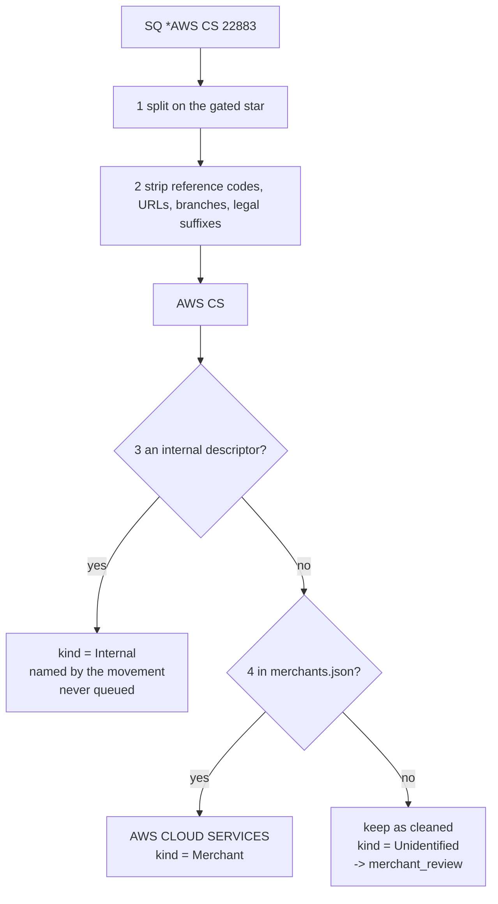
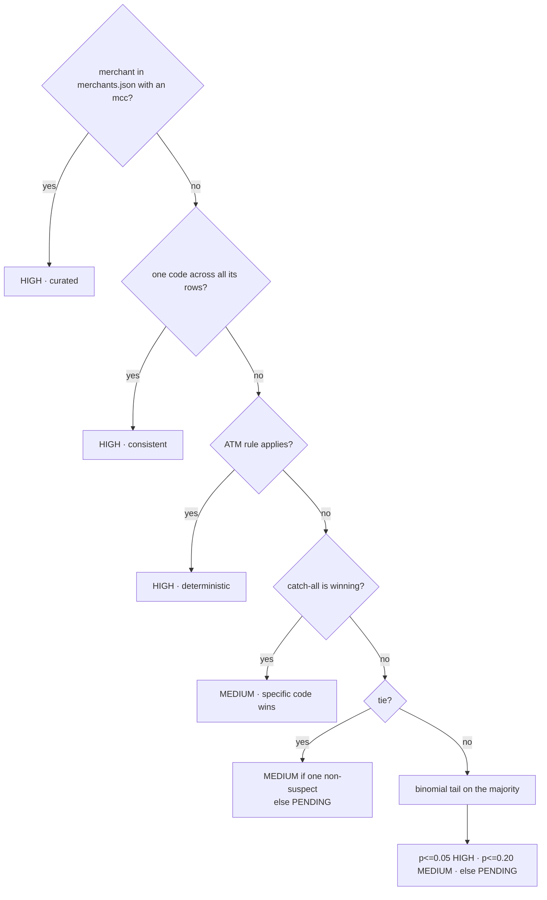

# Architecture

How each cleaning stage works, one stage per section. Every section follows the
same shape: **input → steps → output → the hard case**.

[`README.md`](README.md) says what the pipeline is, how to run it and what it
produced. This file says why each stage decides what it decides. A run's
outcome — how many rows each rule caught — lives there, not here, so the two
never drift.

---

## Table of contents

- [The shared contract](#the-shared-contract)
- [Execution order and why](#execution-order-and-why)
- [Stage 1 — Dates](#stage-1--dates)
- [Stage 2 — Duplicates](#stage-2--duplicates)
- [Stage 3 — Codes](#stage-3--codes)
- [Stage 4 — Amounts](#stage-4--amounts)
- [Stage 5 — Missing values](#stage-5--missing-values)
- [Stage 6 — Merchants](#stage-6--merchants)
- [Stage 7 — Cities](#stage-7--cities)
- [Stage 8 — MCC](#stage-8--mcc)
- [Stage 9 — Consistency](#stage-9--consistency)
- [Five rules that apply everywhere](#five-rules-that-apply-everywhere)
- [Adding a stage](#adding-a-stage)
- [Adding a rule file](#adding-a-rule-file)
- [The parity harness](#the-parity-harness)

---

## The shared contract

Every stage is a class with two methods, and the split between them is the
whole contract.

```python
class BaseCleaner(ABC):
    def apply(self, df: pd.DataFrame) -> pd.DataFrame: ...      # marks
    def metrics(self, df: pd.DataFrame) -> Iterator[...]: ...   # counts
```

| Rule | Why |
|---|---|
| Takes a frame, returns a **new** frame | The input is never mutated, so a stage can be rerun |
| Same shape for every stage | The pipeline holds them in a list and runs them without knowing what any does |
| `apply` marks rows and counts nothing | See below — this is what makes the stage portable to Spark |
| `metrics` derives every total from columns | A step that quietly nulls 400 rows looks identical to one that changed nothing |
| Steps are constructor arguments, not hardcoded | You can run one stage alone while developing it |

```python
TransactionCleaner(steps=[DateNormalizer]).run(df)   # one stage
TransactionCleaner().run(df)                         # all nine
```

### Mark, don't count

A stage never computes a total while it is touching rows. It writes a
**diagnostic column** saying what it did to each row — which date format was
read, whether an amount had to be reformatted, whether a balance reconciled —
and the run's totals are derived from those columns afterwards, in one pass,
by `TransactionCleaner.run`.

The reason is that a running total has to live somewhere outside the rows, and
the only places to put one are a closure or an accumulating call like `.sum()`.
Both are single-process constructs. This is what the code used to look like:

```python
matched: dict[str, int] = {}
parsed = df[source].map(lambda v: self._parse(v, compiled, null_tokens, matched))
for fmt, count in sorted(matched.items(), key=lambda kv: -kv[1]):
    self.log(f"{source}.format[{fmt}]", count)
```

`matched` is filled in as a side effect, once per row, and works only because
`.map` runs every row in one process. Distributed, each executor gets its own
copy, fills it in, and discards it; the driver reads back the original, still
empty, and reports zero for every format. No error, no warning — just a report
that lies. Writing the format onto the row instead is the operation that
survives the move, because the mark travels with the row it describes.

It also makes the audit trail a property of the data rather than of the run.
"How many amounts were reformatted" and "was *this* amount reformatted" stop
being two questions answered in two places.

| Written by | Column | Says |
|---|---|---|
| dates / timestamps | `*_FORMAT` | Which rule read the value, or `NULL_TOKEN` / `UNRECOGNISED` / `UNPARSEABLE` |
| timestamps | `TXN_TS_SLASH_RESOLUTION` | Which of the three passes settled a `NN/NN` date |
| amounts | `TXN_AMOUNT_COERCION` | `PARSED` / `REFORMATTED` / `UNPARSEABLE` / `ABSENT` |
| amounts | `TXN_AMOUNT_SIGN`, `PROCESSING_CODE_DIRECTION` | Where the sign came from, and on whose authority |
| duplicates | `EXACT_DUPLICATE_COPIES`, `TXN_ID_COLLISION` | How many source rows this one stands for; whether its key was shared |
| missing | `AUTH_CODE_REPEATED` | The code recurs across the file, so it was planted |
| balance | `RUNNING_BALANCE_CHAIN_BREAK` | This published balance does not lead to the next one |
| mcc | `MCC_SIGNAL` | Which rule chose the code |

`EXACT_DUPLICATE_COPIES` is the one that needs the trick: the dropped rows are
gone by the end of the run, so the survivor carries the size of the group it
absorbed, and `sum(copies) - len(df)` is what was dropped. In Spark that is one
`groupBy(*columns).count()`.

These are on the frame, not on the cleaned sheet — the sheet states the cleaned
row, and a column saying how a value was arrived at is a second reading of the
column beside it. `AUDIT_COLUMNS` in `utils/columns.py` is the list that
persists to the database, which is where "why does this row look like this" is
the question actually being asked.

---

## Execution order and why

Order is set by real data dependencies, not preference.


| Edge | Reason it cannot be reversed |
|---|---|
| Dates → Duplicates | Collisions are ordered by date; sorting mixed-format date *strings* orders garbage |
| Codes → Amounts | The sign is taken from `PROCESSING_TYPE_CLEANED`, which stage 3 resolves |
| Codes → Missing | Types must settle first, so "unreadable" is distinguishable from "absent" |
| Dates → Missing | `SETTLE_DATE_STATUS` needs a parsed date to call it anomalous |
| Merchants → MCC | MCC layers 3–5 group by the cleaned merchant name |
| Cities → Consistency | The geo check reads `MERCHANT_COUNTRY_EXPECTED` |
| everything → Consistency | It asserts across every derived column, so it runs last |

---

## Stage 1: Dates

**In:** `TXN_DATE_TIME`, `SETTLE_DATE` — 5 formats across 2 columns
**Out:** `TXN_DATE_TIME_CLEANED`, `SETTLE_DATE_CLEANED` as `datetime64`

### Steps

1. Strip the value. If it matches a null token, return `None`.
2. Try each format **in a fixed order**; first regex match wins.
3. Parse with that format's `strptime`.
4. No match → `NaT`, and count it.

### The format table

Order matters. ISO comes first because `YYYY-MM-DD` and `MM-DD-YYYY` both use dashes.

| Format | Example | Rows |
|---|---|---|
| `iso_datetime` | `2022-03-10 00:51:36` | 1214 |
| `slash_day_first_datetime` | `09/07/2022 14:22` | 466 |
| `dash_month_first_datetime` | `04-22-2022 09:15` | 328 |
| `day_month_abbrev_datetime` | `10-Mar-22 00:51` | 175 |
| `epoch_millis` | `1646873496000` | 113 |

### The hard case: 604 ambiguous rows

`09/07/2022` — is that 9 July or 7 September?

**The separator decides.** It is a property of the exporter, verified before use:

```
'/' is day-first    630 unambiguous rows, 0 counterexamples
'-' is month-first  371 unambiguous rows, 0 counterexamples
```

> "Unambiguous" means one component is > 12, so only one reading is possible.

Never fall back to a guessing parser. An unparsed date means **a format we do not
handle yet** — a bug signal. Imputing it hides the bug, and next quarter's file
silently loses rows to a format nobody noticed.

---

## Stage 2: Duplicates

**In:** the full frame
**Out:** same rows, plus `TXN_ID_SEQ`

### Two different defects, treated differently

| Case | Meaning | Action |
|---|---|---|
| Byte-identical row | double-load | **drop** |
| Same `TXN_ID`, different rows | upstream key fault | **keep both**, sequence them |

The second is never dropped — two rows sharing an ID may be two real
transactions with real amounts.

### Why a separate column

```python
df["TXN_ID_SEQ"] = 0        # 0 normally, 1..n on collision, ordered by date
```

Suffixing `TXN_ID` to `"4774694-2"` would flip the column's dtype from int to
string — **and only on files that happen to contain a collision.** Code that
works all year breaks in the one quarter that has a duplicate.

This stage is a no-op on the current file and exists for the next one.

---

## Stage 3: Codes

**In:** `PROCESSING_CODE` (int), `MCC_CODE`
**Out:** `PROCESSING_CODE_CLEANED`, `PROCESSING_TYPE_CLEANED`, `MCC_CODE_CLEANED`, `MCC_CATEGORY`

### The principle

> A code spelled with digits is not a number. Arithmetic on it is meaningless
> and its leading zeros carry meaning, so its canonical form is a **string**.

An integer column destroyed the leading zeros. Padding restores them:

| Stored as int | ISO 8583 field 3 | Label | Rows |
|---|---|---|---|
| `0` | `00` | Purchase | 2112 |
| `1` | `01` | ATM Cash Withdrawal | 71 |
| `20` | `20` | Purchase Return/Refund | 113 |

> The full ISO field is 6 digits (type, from-account, to-account). This export
> carries only the leading transaction-type pair, hence width 2 and not 6.

### Labels are regenerated, never trusted

```python
labels = df["PROCESSING_CODE_CLEANED"].map(codes.get)
```

The incoming `PROCESSING_TYPE` text is not copied — it is **recomputed from the
code** and the old value compared against it. A future file spelling it `"ATM
WITHDRAWAL"` still lands on one canonical value, and the disagreement is counted.

> **Honest limit.** `PROCESSING_CODE` is 1:1 with `PROCESSING_TYPE` across all
> 2296 rows, zero disagreements. It is a join key with nothing to join to and a
> validation layer that never fires. Kept because a real switch keys on it.

---

## Stage 4: Amounts

**In:** `TXN_AMOUNT` stored as **text**
**Out:** `TXN_AMOUNT_CLEANED` as float, signed by transaction type

### Three conventions in one column

| Input | Convention | Output |
|---|---|---|
| `(808.41)` | accounting negative | `-808.41` |
| `1,193.50` | comma thousands | `1193.50` |
| `5.727.580,00` | European decimal | `5727580.00` |
| `172,22` | **ambiguous** | depends on currency |

### Steps

1. Drop everything that is not a digit, separator, parenthesis or minus.
2. Parentheses or a leading `-` → negative.
3. **Both** separators present → the **last one** is the decimal point.
4. **One** separator → see below.

### The hard case: a lone comma

`172,22` could be 172.22 or 17222. Resolution order:

```
more than one occurrence          -> thousands       1,193,500
followed by exactly 3 digits      -> ask the currency
anything else                     -> decimal         172,22 -> 172.22
```

The currency is the tiebreaker because **a zero-decimal currency cannot have
minor units**:

```python
ZERO_DECIMAL = {"LBP", "JPY", "KRW", "VND", "IQD"}
```

So `5.727.580,00` under LBP is 5,727,580 — not 5.72.

### The sign the source dropped

Parsing recovers a negative only when the cell carries one to recover — a
leading `-`, or accounting parentheses. 13 rows carry neither:

| Stored as | Example | Sign survived? |
|---|---|---|
| number | `-104.39` | yes |
| text, parenthesised | `(808.41)` | yes |
| **text, bare** | `409.34` | **no — 13 rows** |

All 13 are purchases, and every purchase stored as a number in this file is
negative, so the convention is not in doubt: the sign was lost by whatever
wrote those cells as strings.

So the sign is not read from the cell at all. It is taken from the transaction
type, which states the direction of the money independently of how the amount
happened to be formatted:

```python
refund = df["PROCESSING_TYPE_CLEANED"].astype(str) == REFUND_LABEL
signed = df[target].abs().where(refund, -df[target].abs())
```

Only the sign moves; the digits are what the source got right. Corrected rows
are counted as `TXN_AMOUNT_CLEANED.sign_restored` **and** flagged
`AMOUNT_SIGN_RESTORED` per row, because the value now differs from the one in
`raw_transactions` and that has to be traceable to the transaction.

---

## Stage 5: Missing values

**In:** `TERMINAL_ID`, `AUTH_CODE`, `SETTLE_DATE_CLEANED`
**Out:** `HAS_TERMINAL`, `AUTH_CODE_VALID`, `SETTLE_DATE_STATUS`

### The whole policy follows from one split

| Kind | Meaning | Treatment |
|---|---|---|
| **Absent** | never recorded | leave null |
| **Unreadable** | present but unparseable | leave null, **always count** |
| **Not applicable** | legitimately has no value | keep the value, add a flag |

Collapsing "unreadable" into "absent" is the costly mistake — it turns a bug
signal into a silent gap.

### Per column

| Column | Count | Kind | Action |
|---|---|---|---|
| `TERMINAL_ID` = `00000000` | 1051 | not applicable | `HAS_TERMINAL = False` |
| `AUTH_CODE` sentinel/repeat | 109 | absent / invalid | `AUTH_CODE_VALID = False` |
| `SETTLE_DATE` | 14 | absent | `SETTLE_DATE_STATUS = MISSING` |
| `MERCHANT_CITY` | 67 | absent | leave blank, no imputation |

### `TERMINAL_ID` at 46% is signal, not dirt

**0 of 71 ATM rows carry the sentinel** — an ATM is itself a terminal. So the
sentinel marks *card-not-present*, and imputing or dropping it would destroy the
card-present distinction.

### The hard case: nulls wearing three disguises

`SETTLE_DATE`'s 14 gaps arrive as:

```
blank        3    fails isna()  ✓
0000-00-00   9    MySQL zero-date   -- reads as an ordinary value
1970-01-01   2    epoch zero        -- reads as an ordinary value
```

Only the blanks fail an `isna()` check. The other 11 would have **parsed into
real 1970 dates**. So every disguise collapses to `NaT` *before* any other
decision, and "is it missing" then has exactly one answer in one place.

### Why the date stays null

The lag distribution looks safe to impute (0–4 days, mode 1, median 2). It is not:

- A +2 day estimate is right only **31.9%** of the time; the mode (+1) only 42%.
- The affected accounts settle at observably different speeds.
- `TXN_ID 4774694` is `Unmatched` — settlement is not even established, so an
  estimated date would assert an unevidenced event.

`SETTLE_DATE_STATUS` carries the state instead, as `MISSING`.

The sheet does print `UNKNOWN` in `settle_date_cleaned` for those rows, because
a blank cell reads as "nothing to say here" as easily as "not settled yet". But
it is printed by `render_dates` on the way out, in the same pass that applies
the display format, and nowhere earlier. Holding the string in the column would
be the **same defect as `0000-00-00`** — a text placeholder in a date field,
forcing the column to text and breaking every sort and date calculation after
it. The status column is the machine-readable half and says `MISSING`, not
`UNKNOWN`, so it states what the source did rather than repeating the word in
the cell beside it. The same treatment is applied to `running_balance` and to
`running_balance_cleaned`, whose blanks go out as `UNKNOWN` for the same reason:
a withheld balance is a decision the pipeline took, not a cell nobody filled in,
and `running_balance_status` beside it names which decision — `CONTRADICTED`,
`UNVERIFIED` or `UNKNOWN`. Both stay real nulls inside the pipeline; only the
rendered copy carries the word.

### Two balance columns, and why they are not one

`running_balance_cleaned` states a balance only where the arithmetic proves
one, which leaves 80,808 rows blank. `running_balance_adjusted` answers a
different, weaker question — *what would the balance be if this account's own
transactions were the only thing that moved it?* — and answers it wherever
there is a trusted balance to count from.

They are separate columns because they are separate claims. The first is
evidence; the second is arithmetic. Merging them would let a projected figure
be read as a proven one, which is the entire failure mode the balance step
exists to prevent.

Each row counts from the **nearest** trusted balance, not one anchor per
account: anchoring each account at its first verified row reproduces the
surviving later balances 43.6% of the time, and re-anchoring at the nearest one
raises that to 67.9%. Rows before an account's first trusted balance count
backwards from it — the same arithmetic with the sign reversed. Neither
direction crosses an unreadable amount, because a running total with a hole in
it is short by an amount nobody can name.

`running_balance_adjusted_status` says how far each value can be trusted:

| Status | Meaning |
|---|---|
| `VERIFIED` | the row already has a proven balance; this column repeats it |
| `CONFIRMED` | projected, and a later trusted balance is reached exactly |
| `CONTRADICTED` | projected, and a later trusted balance is **not** reached — the file is missing money that moved, and this figure is wrong by that amount |
| `UNTESTED` | projected, with nothing after it to check against |
| `NO_ANCHOR` | the account never had a trusted balance; no value |

`CONTRADICTED` is not a defect in the projection. It is the projection working
correctly and reporting that the transaction list is incomplete: on the
accounts that can be checked, counting transactions forward misses the real
balance on 92 of 153. The value is still stated, because a reader who asked for
a balance everywhere should get one — but it is labelled, so nobody has to
discover the problem by being wrong about it later.

### Auth codes: why any repeat is suspicious

```
6 alphanumeric chars  ->  ~2.2 billion combinations
across ~2300 rows     ->  ~0.001 expected genuine collisions
```

So a repeat is a planted value, not chance. Threshold is 2. **4 values repeat.**

---

## Stage 6: Merchants

**In:** `MERCHANT_NAME` — the dirtiest column
**Out:** `MERCHANT_NAME_CLEANED`, `MERCHANT_PROCESSOR`, `MERCHANT_KIND`,
`MERCHANT_TYPE`, `MATCHES_STATUS_CLEANED`, `merchant_review` sheet

This stage has **two halves that must not be confused**: string cleaning, then a
lookup. Cleaning cannot finish the job, and no amount of extra regex changes that.



### Three kinds, because the column holds three kinds of thing

`MERCHANT_NAME` is not always a merchant. 41293 rows of the workbook and 176064
of the forecast extract describe money moving **inside the bank** — settlement,
standing orders, sweeps between a customer's own accounts. Counted as merchants,
`CARD SETTLEMENT` is the largest one in the file by a factor of seven.

| Kind | What it is | Status | Queued? |
|---|---|---|---|
| `Merchant` | a counterparty the master names | `Confirmed` | no |
| `Internal` | money moving inside the bank | `Not a merchant` | no — already decided |
| `Unidentified` | a counterparty nobody has named yet | `Pending` | **yes** |

`MERCHANT_TYPE` collapses these to the two a reader is choosing between —
`Merchant` or `Internal`. A name nobody has resolved yet is still a
counterparty, and how far resolving it got is `MATCHES_STATUS`'s question.

Both `MERCHANT_TYPE` and `LOCATION_TYPE` are working columns: they are on the
frame and in the audit trail, not on the cleaned sheet, which carries one
column per source column and no verdicts. `MATCHES_STATUS` is the one that
goes out, because it is the column the source itself had.

An internal row is named by its movement, spelled in words: `CARD SETTLEMENT`,
`STANDING ORDER`, `INTERNAL TRANSFER`. The kind token behind it (`STANDING_ORDER`)
is a key in `internal_descriptors.json` and stays there — a column that otherwise
holds `CARREFOUR` should not hold an identifier. Naming the movement rather than
the descriptor is deliberate: the descriptor is truncated to eleven lengths and
eight of them identify the kind without identifying whether it was
`TRANSFER TO CURRENT` or `TRANSFER TO SAVINGS`, and the direction is already on
the row in the amount's sign.

`internal_descriptors.json` holds the descriptors, deliberately outside the
merchant master. What separates them from the employers they resemble
(`INDEVCO`, `MUREX`, `AUB PAYROLL`) is **`PROCESSING_TYPE`, not spelling**: every
descriptor row is settlement or transfer with zero purchases, while every
employer row is `SALARY_CREDIT` at 6012 and is a real counterparty.

Internal rows are named by the **kind** of movement, not by the descriptor. The
descriptor is truncated to eleven different lengths, and eight of them identify
the kind without saying which of `TRANSFER TO CURRENT` or `TRANSFER TO SAVINGS`
it was. Naming the kind states exactly what is known; the direction is already
on the row in the amount's sign.

### Truncation: one merchant as nine lengths of itself

The forecast source cuts `MERCHANT_NAME` to a field width, so a name survives at
every length it was cut to — and so does the `-CARD PMT-` suffix behind it. The
two are told apart by the dash:

```
H AND M -C  -CA  -CAR  -CARD PMT-   ->  a dash there can only be the suffix; any length goes
H AND M CARD  CARD P  CARD PM       ->  no dash: nothing shorter than the whole word CARD
METRO CASH CAR                      ->  ...because this is METRO CASH CARRY, not METRO CASH
```

Reading a dashless tail as the suffix deleted the real last word and left seven
merchants too short to recover. What survives the strip is settled by the
master, where a prefix identifies a name **only when exactly one merchant
extends it**. `AMERICAN UNIVERSITY BEIR` resolves; `CARREFOUR` and `PHARMACIE`
do not, and go to review rather than to whichever candidate sorted first. That
ambiguity check is also the enforcement behind `trap_pairs.json`: a never-merge
group holds two entries by definition, so no prefix can ever reach both.

### Half 1 — string cleaning

#### The gated `*` split

The merchant sits on **either side** of the star:

```
SQ *TAKEALOT           -> processor left,  merchant right
COURSERA.COM *W2PA     -> merchant left,   ref code right
```

A blind split would corrupt **114 merchants**. So the split only fires when the
left token is on a whitelist:

```json
"prefixes": ["SQ", "IZ", "TST", "WPY", "SP", "PP", "PAYPAL", "GOOGLE"]
```

The whitelist was derived by frequency — a genuine processor precedes many
unrelated merchants, a merchant appears once:

```
SQ 83 · IZ 72 · TST 55 · WPY 45 · SP 42 · PP 39 · PAYPAL 36 · GOOGLE 35
114 tokens appearing exactly once (MALIK BKSHP, WAYFAIR.COM, FEDEX.COM …)
```

#### Then, in order

| Step | Removes | Example |
|---|---|---|
| `STAR_REF` | a **second** `*` + code | `DEUTSCHE BAHN *TNAS` → `DEUTSCHE BAHN` |
| `REF_SUFFIX` | `/xyz` | `AUTOZONE /lzx` → `AUTOZONE` |
| `URL_SUFFIX` | `.COM`, `.LB`, … | `COURSERA.COM` → `COURSERA` |
| `BRANCH` | numbered branch | `CREPAWAY BR 306` → `CREPAWAY` |
| `LEGAL` | `LTD`, `SARL`, … | `PARKING SERVICES LTD` → `PARKING SERVICES` |
| token filter | reference codes, store numbers | `REPSOL #70 *4GK9` → `REPSOL` |
| `TRAILING_BRANCH` | bare `BR` at the end | `AMERICAN UNIVERSITY BR` → `AMERICAN UNIVERSITY` |

The token filter is the subtle one:

```
mixes letters and digits  -> always a code       K0SA, 4GK9   drop
pure digits, not first    -> store number        #70, 3382    drop
pure digits, first        -> part of the name    7 ELEVEN     keep
```

### Half 2: the merchant master

String cleaning gets variants *close* but never *equal*. One merchant arrives in
up to five forms:

| Form | Example |
|---|---|
| full | `WATERSTONES` |
| vowel-dropped | `WTRSTNS` |
| truncated | `YOUTUBE P` |
| space-stripped | `GOOGLEADS` |
| abbreviated | `CVS PHCY` |

So the final step is a **lookup, not a transformation**. `merchants.json` holds
one entry per merchant:

```json
"AWS CLOUD SERVICES": {
  "aliases": ["AWS CLOUD SERVI", "AWS CLOUD SVCS", "AWS CS", "AWSCLOUDSERVICES"],
  "note": "kept separate from AMAZON MARKETPLACE: same parent, different
           business (7372 vs 5999). MCC describes what was sold",
  "added_by": "Joseph Am-Makhlouf", "added": "2026-08-17"
}
```

An unrecognised name is never guessed: it keeps its cleaned form, its kind is
`Unidentified`, and it enters `merchant_review` with its raw spellings,
countries and observed MCCs. Internal movements never enter that queue — they
are unrecognised as merchants because they are not merchants, which is a
decision already taken rather than a question for a reviewer.

### The hard case: similarity is a hint, never the decision

Two traps that string distance gets wrong:

| Pair | Looks like | Actually |
|---|---|---|
| `WTRS` / `WTRSTNS` | one merchant | **Waitrose** 5411 grocery vs **Waterstones** 5942 books |
| `MEZYAN` / `MEZYANE` | one merchant | 5812 restaurant vs 5691 clothing, both LB |

Every merge was confirmed against **MCC + country**, not spelling. That is also
how `ADBL`→Audible (5815/US), `ATZN`→AutoZone (5533/US) and `CRM`→Careem
(4121/AE, *not* Crepaway 5812/LB) were settled.

Where the evidence disagreed, **nothing was asserted**: `TSC S` is 5411 in LB
while `SULTAN CENTER` is 5411 in KW, so it stays in review.

### Two naming rules

| Rule | Applied to |
|---|---|
| Brand relationship ≠ merchant identity | `AWS CLOUD SERVICES` stays separate from `AMAZON MARKETPLACE` |
| Country qualifiers are dropped | `CARREFOUR EGYPT`/`UAE`/`FRANCE` → `CARREFOUR`, since `MERCHANT_COUNTRY` carries geography |

One documented exception: `TOTAL LEBANON` keeps its suffix, because bare `TOTAL`
would collide with the unrelated `TOTAL WINE` and `TOTAL FITNESS CTR`.

---

## Stage 7: Cities

**In:** `MERCHANT_CITY`, `MERCHANT_COUNTRY`
**Out:** `MERCHANT_CITY_CLEANED`, `IS_ECOMMERCE`, `MERCHANT_COUNTRY_EXPECTED`

### Steps

1. Uppercase, then map through `city_aliases.json`.
2. Mark `IS_ECOMMERCE` from the marker tokens **or** a missing terminal.
3. Look up the expected country in `city_countries.json`.

### Two kinds of variant collapse in one map

| Kind | Example | Rows |
|---|---|---|
| transliteration | `BEIRUT` / `BEIRUT LB` / `BEYROUTH` / `BEYRUT` | 329 |
| card-not-present marker | `INTERNET` / `ECOM` / `E-COMMERCE` | 1051 |

**128 distinct → 107.** Three merges were found only after the geo check below
made them visible, and each was confirmed by **shared merchants**, not spelling:

```
ASHRAFIEH  = ACHRAFIEH   (only ASHRAFIYA was listed)
JBEIL      = BYBLOS      Cave de Byblos, Gift Corner Jbeil appear under both
AL HAMRA   = HAMRA       Beauty Lounge Hamra, Mezyan appear under both
```

### The check: city implies country

A city sits in exactly one country, so the pair is verifiable. Before building
it, two things had to be established.

**1. Which field is wrong.** `CARREFOUR` settles it — it legitimately spans four
countries and its pairing is correct on every row:

```
ABU DHABI -> AE     CAIRO -> EG     PARIS -> FR     BEIRUT -> LB (7)
                                                    BEIRUT -> US (2)  <- noise
```

However, one limitation here could arise when facing a city that shares its name with other cities in different countries (e.g., Tripoli -> Lebanon/Libya).

> **The merchant's own modal country is not a usable witness.** `SNCF CONNECT`
> carries `PARIS`+GB five times against `PARIS`+FR once, so the mode reports GB
> for a French railway. The noise outvotes the truth.

**2. That it is noise, not unmodelled geography.** All 148 bad values come from a
set of four:

```
US 79 · TR 34 · GB 24 · IE 10
```

Real geography does not concentrate like that.

### Why the reference is asserted, not computed

`city_countries.json` states 105 city→country pairs rather than taking the modal
country at runtime. **Deriving the rule from the data it polices is circular**,
and it fails immediately: `DELFT` has one row, an IKEA transaction tagged SE, so
the mode would place a Dutch city in Sweden.

All 105 were hand-checked; that was the only one the mode got wrong.

### `INTERNET` + `LB` is not an error

The marker sits in the *city* field; the country still describes where the
merchant is registered. So `INTERNET`+`LB` reads "online purchase from a
Lebanon-registered merchant" and nothing conflicts. Those rows get a **blank**
expectation and are never flagged.

> Not knowing where a merchant is differs from placing it in the wrong country.
> Only the second is a defect.

### Blank cities are not imputed

Country does not determine city, so there is nothing to derive from. Only 18 of
the 67 are card-not-present, so "it's e-commerce" does not explain the rest —
and for those 18, `IS_ECOMMERCE` already carries the fact. Writing `INTERNET`
into a city column would encode the same thing twice, in a fake location.

---

## Stage 8: MCC

**In:** `MCC_CODE_CLEANED`, `MERCHANT_NAME_CLEANED`, `PROCESSING_TYPE`
**Out:** `MCC_CODE_SUGGESTED`, `MCC_CONFIDENCE`, `mcc_review` sheet

The workbook's second sheet is a 41-entry `MCC_CODE → CATEGORY` reference. That
turns MCC into an independently verifiable field.

### Signals, in strict priority order



| # | Signal | Basis |
|---|---|---|
| 0 | **Curated** | A human `mcc` in `merchants.json`. Beats everything |
| 1 | **Consistent** | One code across every row. Nothing disagrees |
| 2 | **Deterministic** | The reference labels `6011` *"ATM Cash Withdrawal"* — the exact string `PROCESSING_TYPE` uses |
| 3 | **Catch-all override** | `5999` is a bucket with no meaning, so a specific code beats it *regardless of count* |
| 4 | **Suspect tiebreak** | On a tie, a specific code beats `5812`/`5817` |
| 5 | **Majority** | Scored by a binomial tail, giving a real p-value |

### Signal 2 is the strongest, because it needs no merchant cleaning

```
71 ATM Cash Withdrawal rows  ->  65 carry MCC 6011
                                  5 carry 5999
                                  1 carries 5812     = 6 violations
```

### Signal 3 is the one that matters most

Majority vote returns **flatly wrong** answers on this data:

```
USJ BEIRUT   5999:7  8220:3   ->  vote says "Miscellaneous Retail" for a university
```

The rule flips it to `8220 Colleges, Universities`. Rationale:

> **`5999` is a bucket, not a category.** It is what an acquirer assigns when it
> does not know. It carries no positive information, so it can never win.

Applies to 30 merchants:

```
BOOTS PHARMACY 5999:5 5912:3 -> 5912 Drug Stores
OGERO          5999:4 4814:3 -> 4814 Telecommunication Services
DHL EXPRESS    5999:3 4215:2 -> 4215 Courier Services
ZARA           5999:4 5651:2 -> 5651 Family Clothing
```

### Not every suspect code is the same kind

| Code | Nature | Treatment |
|---|---|---|
| `5999` Misc Retail | pure bucket | never wins |
| `5812` Eating Places | **real category** also used as noise | only loses head-to-head |
| `5817` Digital Goods | **rail artifact** — see below | only loses head-to-head |

`PRET A MANGER` is `5812:8 / 5999:3` and genuinely *is* a restaurant. Demoting
5812 by identity would punish a correct answer.

**`5817` has a mechanical explanation.** All 26 rows carrying it are
Google-Pay-prefixed — **26 of 26**. The acquirer stamps that rail as *Digital
Goods, Applications* regardless of merchant (Ryanair, Carrefour, AXA, Avis). It
is not a category judgement at all.

### Confidence: three states

Three, because three is what a reader can act on.

| State | Meaning | Rows |
|---|---|---|
| `HIGH` | settled — curated, consistent, deterministic, or p ≤ 0.05 | 2230 |
| `MEDIUM` | inferred — catch-all override, tiebreak, or p ≤ 0.20 | 58 |
| `PENDING` | a human still has to decide | 8 |

Provenance is not lost to the collapse — it is logged:

```
signal[curated]     1222      signal[unresolved_tie]        8
signal[consistent]   973      signal[catch_all_override]    7
signal[majority]      80      signal[deterministic]         6
```

### Only PENDING reaches the review queue

**1 merchant** on this file: `ABC VERDUN` (`5812:4 / 5999:4`), a Beirut mall
where food court versus mixed retail is a genuine judgement call.

> A queue listing resolved items trains reviewers to skim it, which is how the
> one row that needs a decision gets missed.

### The known failure mode

The catch-all rule assumes the specific code is true. That breaks when the
merchant genuinely *is* miscellaneous retail:

```
NOON COM   5999:6  5812:4   ->  rule would wrongly suggest "Eating Places"
```

`NOON COM` is a general marketplace, so it is **pinned** to 5999 in
`merchants.json`. This is exactly why signal output is a review queue and never
an auto-applied repair.

### Why not a model

| Objection | Detail |
|---|---|
| It would not solve it | `USJ` fails because identifying it needs *entity knowledge* — that USJ is Université Saint-Joseph. Embeddings of "USJ BEIRUT" and "Colleges, Universities" are not close |
| It breaks auditability | "Why did this merchant get this MCC" stops having a stable answer |

The better answer is **reference data, not inference**: an internal merchant
master is authoritative and needs no guessing.

---

## Stage 9: Consistency

**In:** every derived column
**Out:** `VALIDATION_FLAGS` (changes no data)

### The idea

The dataset states some facts more than once. Redundancy becomes the validation
layer rather than something to collapse.

| Flag | Rule |
|---|---|
| `REQUIRED_NULL[…]` | 5 columns that make a row unusable if null |
| `SETTLE_BEFORE_TXN` | `SETTLE_DATE < TXN_DATE` |
| `GEO_CITY_COUNTRY_MISMATCH` | city implies a different country |
| `REFUND_NEGATIVE` | refund with a negative billing amount |
| `PURCHASE_POSITIVE` | purchase with a positive billing amount |
| `FX_RECONCILE_MISMATCH` | the two amounts do not reconcile at the stated rate |
| `FX_RATE_OFF_REFERENCE` | the stated rate is not plausible for its currency |
| `CODE_TYPE_MISMATCH` | label disagrees with its code |
| `MCC_ATM_MISMATCH` | raised in stage 8 |
| `AMOUNT_SIGN_RESTORED` | raised in stage 4 |

How many rows each one caught on the current file is in
[README](README.md#results-on-the-source-file), which is where a run's outcome
is recorded. Repeating it here would mean two copies drifting apart.

### The amount is stated twice

`TXN_AMOUNT` in local currency and `BILLING_AMOUNT` in USD, with `FX_RATE`
between them, so the two have to reconcile:

```python
expected = df["TXN_AMOUNT_CLEANED"].abs() * rate
drift = (expected - billed.abs()).abs() / expected
```

Magnitudes, not signed values: the local amount is signed by transaction type
and the billing amount by its own convention, so comparing them signed would
flag every refund. The direction is what the sign checks above are for.

The rate multiplies rather than divides. That is worth stating because the
wrong direction hides in plain sight — on the 1090 USD rows the rate is 1 and
both directions agree. Across the file, multiplying reconciles 2244 of 2296
rows; dividing reconciles only those 1090.

`FX_TOLERANCE` is relative, at 1%. `FX_RATE` is stored to six decimals, so a
large transaction reconciles to within a rounding error rather than exactly,
and a fixed tolerance would flag every large row or miss every small one across
the four orders of magnitude this file spans.

**48 rows do not reconcile**, and none of them are among the 13 signed rows —
these are a separate defect. 23 have a billing amount exactly 1/100 of what the
rate implies; the rest are off by 5–35%, consistent with a stale rate.

### A row can be perfectly consistent and still wrong

Reconciliation only proves a row agrees with itself. A transaction that states
a dead exchange rate **and** a billing amount computed from that dead rate
reconciles exactly, and is wrong by a factor of twenty. Nothing inside the row
can reveal that, so the check needs an outside reference — `fx_rates.json`,
one rate per currency, expressed as units per USD.

The reference is deliberately **not** used to recompute `BILLING_AMOUNT`. The
file covers March–September 2022 and rates move over seven months: EUR ranges
1.0631–1.1098, GBP 1.2393–1.2907. Applying one fixed rate across that window
flags 820 rows at 1% tolerance and 393 even at 10%, nearly all of them
perfectly correct transactions priced on a different day. So the reference
answers only the narrow question it can answer: *is this row's own rate
plausible for this currency at all?*

`FX_REFERENCE_TOLERANCE` is 15% for the same reason — wide enough that
ordinary movement never trips it. Every floating currency in the file stays
within 4.3% of its own median, so the check is silent on fifteen of the
sixteen currencies.

**It fires on 481 rows, all of them LBP.** 100 of those still state the
1507.5 official peg, abandoned in practice years before these transactions;
the rest range from 26,000 to 38,000 to the dollar. The reference is set at
89,500, so every LBP row is flagged rather than only the stale-peg ones — see
`_lbp_note` in the rule file, which is one number away from the alternative.

> **Why this one is flagged and not repaired.** Three values and one equation:
> the amount, the rate, or the billing figure could each be the wrong one, and
> the arithmetic cannot say which. Repairing would mean inventing a number.
> Stage 4's sign restoration is repaired precisely because it does not have
> this problem — the transaction type says unambiguously which value is wrong.

### Flags accumulate, they do not overwrite

```python
flags = existing.map(lambda v: [f for f in str(v).split(";") if f])
```

Stage 8 already wrote `MCC_ATM_MISMATCH`. Starting from a blank column here
would silently erase it.

### Why flag and not fix

The 6 impossible settlement dates settle **one day before** the transaction. All
are `Match`/`Settled` with times spread across the day, so a timezone boundary
does not explain them.

> We cannot know **which of the two dates is wrong**, so correcting either would
> be a guess.

### The one legitimate reason to drop a row

A null in the required set — `TXN_ID`, `ACCOUNT_ID`, `TXN_DATE_TIME`,
`TXN_AMOUNT`, `TXN_CCY`. This file has none. That is a hard failure, not a
cleaning task.

No row is ever dropped for a null anywhere else. Deleting 67 complete
transactions to fix one descriptive field would destroy more than it repairs.

---

## Five rules that apply everywhere

### 1. Never overwrite a source column

Every stage adds a `*_CLEANED` column beside the original rather than writing
over it. Applied without exception:

| Field | Original | Derived |
|---|---|---|
| Amount | `TXN_AMOUNT` (text) | `TXN_AMOUNT_CLEANED` (float) |
| MCC | `MCC_CODE` | `MCC_CODE_CLEANED` + `MCC_CONFIDENCE` |
| Country | `MERCHANT_COUNTRY` | `MERCHANT_COUNTRY_CLEANED` |
| Settlement | `SETTLE_DATE` | `SETTLE_DATE_CLEANED` + `SETTLE_DATE_STATUS` |

The suffix comes off on the way out — sheets are written lowercase and
unsuffixed — but it exists inside the pipeline so both versions can sit side by
side while a stage decides.

`raw_transactions` ships all 19 source columns byte-for-byte, joinable on
`TXN_ID`, so the workbook is self-auditing. The cleaned sheets then show **only**
the cleaned columns — a text `TXN_AMOUNT` beside a float one invites a total
computed from the wrong column.

### 1b. The cleaned sheet is one column per source column

Exactly one: the cleaned counterpart where a stage produced one, the original
where none did, and nothing else. Every column on that sheet answers *what
does this transaction say*.

Everything a stage derives that is not a cleaned counterpart — statuses,
confidences, precisions, coverage flags, the projected balance — answers a
different question, *how do you know*, and is answered in two other places
instead: the totals in `cleaning_report`, and the per-row detail in
`AUDIT_COLUMNS`, which is what reaches the database in Stage 2. Nothing is
discarded; `INTERNAL` in `utils/columns.py` is a list of what the writer
hides, not of what the pipeline forgets.

One exception, and it is not really one: `TXN_TS_PRECISION` passes through to
the writer and is dropped by it. The writer needs it to know whether a row may
be written with a time of day at all. Hiding it a step earlier would put
`00:00:00` on all 18,592 date-only rows — a reading the source never gave, and
indistinguishable on the sheet from the 51 transactions that really did happen
at midnight.

### 2. Rules in JSON, logic in Python

| File | Holds |
|---|---|
| `processors.json` | processor prefixes |
| `date_formats.json` | format patterns + null tokens |
| `processing_codes.json` | ISO codes → labels |
| `fx_rates.json` | Currency → units per USD |
| `city_aliases.json` | city spellings + e-commerce markers |
| `city_countries.json` | 105 city → country |
| `mcc_rules.json` | catch-all, suspect codes, thresholds |
| `merchants.json` | 270 merchants, 336 aliases, 137 asserted MCCs |

Vocabularies change as new data arrives; the code applying them does not.
Updating a vocabulary needs no logic review, and non-engineers can read it.

They live **inside** the package, because `pip install` would leave them behind
otherwise and every import would break in production.

### 3. Dates are datetimes until the moment of writing

Held as `datetime64` in the frame; `dd-mm-yyyy hh:mm:ss` is applied only in
`write_workbook`. As text, `"09-07-2022"` sorts before `"10-01-2021"` because
strings compare character by character, and every sort, filter and date
calculation silently breaks.

---

### 4. A value is repaired in place only when the data says which column is wrong

Two things meet that bar. An MCC the merchant's own transaction history
contradicts, and the sign a purchase lost when its amount was written as text:
in both, a second field settles which value is the wrong one.

Everything else is flagged and left alone. Where the amount and the billing
amount fail to reconcile, any of the three values involved could be the liar
and the arithmetic cannot say which, so the pipeline says so and stops. The
distinction is not caution for its own sake — it is whether the data contains
the answer.

### 5. Every step reports, and none of them counts

`CleaningReport` is passed to every stage and accumulates across the run.
Without it, a step that quietly nulls 400 rows is indistinguishable from one
that changed nothing. It is also the only place a run's outcome is recorded,
which is what lets this document stay free of counts.

What it no longer is, is something a stage writes to while it runs. Every
entry is derived after the last stage finishes, from the diagnostic columns
described in [the shared contract](#mark-dont-count). Collecting in step order
is what keeps the report reading the same as it always did.

---

## Adding a stage

1. Subclass `BaseCleaner`, implement `apply`, set `name`.
2. Have `apply` write a diagnostic column for anything you want counted, and
   implement `metrics` to derive those counts from it. Do not reduce inside
   `apply` — see [Mark, don't count](#mark-dont-count).
3. Put any vocabulary in `rules/json/` and add a `loader` function.
4. Insert it in `DEFAULT_STEPS` at the point its dependencies allow.
5. If it produces a review queue, expose `review_queue()` and add the sheet in
   `build_sheets`.
6. Add derived columns to `PRESENTATION_ORDER` in `utils/columns.py`, and any
   diagnostic column to `INTERNAL` and `AUDIT_COLUMNS`.

The orchestrator needs no edit — it holds steps in a list and runs them.

## Adding a rule file

1. Put the JSON in `src/rules/json/`, with a `_comment` recording where the
   values came from and what would make them wrong.
2. Add a loader function in `rules/loader.py` returning the shape the caller
   actually needs, not the shape the file happens to have — `city_aliases`
   inverts canonical→variants into variant→canonical for exactly this reason.
3. Add a staleness test. A rule file that has quietly stopped matching
   anything is the failure mode that never announces itself.

### What a test should assert

| Assert | Not |
|---|---|
| the awkward real values from this file | invented round numbers |
| a planted violation is caught | that the count is currently 0 |
| every rule-file key still matches a live row | that the file parses |

The staleness guards matter most: `merchants.json` keys match *cleaned* names,
which shift as `MerchantCleaner` improves, so a dead entry must fail a test
rather than silently do nothing.

---

## The parity harness

The cleaning stages are being ported to Spark. The harness is what makes that
survivable: after every stage, a machine checks that the two engines give the
same answer, on a sample chosen for the cases the stages actually get wrong.

Four modules under `src/spark/`, none of which cleans anything:

| Module | Answers |
|---|---|
| `session.py` | how a `SparkSession` is configured, everywhere |
| `source.py` | how a delimited file is read, deciding nothing |
| `sample.py` | which rows the harness runs on |
| `parity.py` | whether two frames say the same thing |
| `pipeline.py` | which stages are ported, and in what order they run |

### The session states its semantics rather than inheriting them

Four settings change *answers* rather than speed, and all four are written
down even where the written value equals today's default:

| Setting | Value | Because |
|---|---|---|
| `spark.sql.session.timeZone` | `UTC` | every parsed timestamp is read in it, so an unset one makes the output a property of the laptop |
| `spark.sql.ansi.enabled` | `false` | ANSI is on by default in Spark 4 and makes a bad cast *raise*; this pipeline counts bad casts |
| `spark.sql.legacy.timeParserPolicy` | `CORRECTED` | the strict parser yields null instead of coaxing a date out of `2022-13-45` |
| `spark.sql.shuffle.partitions` | `8` | 200 tasks over 265k rows is scheduling overhead with a job attached |

Inheriting a default is a bet that it will not change between versions, and
two of these have already changed once.

### The reader decides nothing

Same discipline as `utils/io.py`, for the same reason: `inferSchema` would
sample the file, guess a type, and coerce on the way in — which pre-empts the
coercion the pipeline is required to perform explicitly and count. Every
column arrives as a string, and every type in the output is a cast some stage
made on purpose.

The schema is derived from the file's own header rather than written out as 22
literal names, and the file is then read with `enforceSchema=false` — so Spark
compares the header it finds against the schema it was given and refuses a
file whose columns moved. Under the default it would apply the schema by
position and hand every stage the column to the left of the one it asked for.

### The sample is chosen, not taken

The first 500 rows are not a sample, they are January. Two properties decide
the design:

**It samples accounts, not rows.** `BalanceReconstructor` works over
`ACCOUNT_ID` ordered by `TXN_SEQ`. Take every third row and every chain
breaks, every gap becomes unclosable, and the stage reports `UNVERIFIED` where
the real run reports `DERIVED` — in *both* engines, so the comparison passes
having proved nothing. A selected account brings all of its rows.

**The accounts are chosen for what they contain:** the widest `TXN_SEQ` spans
(the accounts that cross the balance seam), the narrowest (the ones that live
on one side of it), accounts naming a trap-pair merchant, a greedy cover of
the distinct `TXN_DATE_TIME` shapes, and the accounts withholding the most
balances — then a deterministic fill.

Deterministic rules out `hash()`, which is salted per process, and
`DataFrame.sample`, whose seeding is a numpy detail. The fill orders accounts
by a SHA-256 of the account id. The same source file produces the same 16
accounts and the same 11,417 rows on every machine — the same requirement the
upsert key carries, for the same reason: a sample that drifts turns one
failing stage into a bug report nobody can reproduce.

### What counts as a difference

The whole design problem is the line between a real divergence and a
difference in representation, and it is drawn once here so no stage's test
has to draw it again.

| Not a finding | Is a finding |
|---|---|
| row order — Spark's is a function of partitioning | a changed value |
| column order — imposed by `presented()` at the end anyway | a missing column |
| dtype — `float64` or `double` or the text of the number | a null against a value |
| `Categorical` storage — the labels are the answer | **a null against an empty string** |
| float noise below tolerance — Spark sums in partition order | a float beyond it |

The last row of the left column and the last of the right are the same
distinction seen twice. Money is rounded to the cent by the cleaners
themselves, so anything the tolerance forgives is representation; and
null-versus-empty-string is the distinction this pipeline exists to preserve,
so it is never forgiven.

Rows are aligned on a key — `TXN_SEQ`, then `TXN_ID_CLEANED` — by an index
join rather than by sorting both sides, because sorting silently mis-pairs
every row after the first missing one where a join reports it as missing.

The output is a report, not a boolean: *"`BALANCE_STATUS` differs on 41 rows,
here are five with their keys"* is actionable where *"not equal"* is not.

### How it grows

`SPARK_STEP_REGISTRY` in `src/spark/pipeline.py` is the ledger of what has
been ported. `ported()` returns the longest *prefix* of a profile's steps that
is registered — a prefix and not a filter, because the stages are not
independent: `amounts` signs by what `codes` resolved, `balance` moves by what
`amounts` parsed.

`tests/test_parity.py` runs that prefix through both engines and compares. It
is never edited as the port proceeds: a stage becomes tested by being
registered, and registering one that is not finished turns its parity test red
immediately, which is the intended direction.

With the registry empty it compares the two readers — which is not a vacuous
assertion. It says that 11,417 rows and 22 columns of a genuinely dirty
extract arrive identically through two entirely different readers, including
which cells are null and which are the empty string.
