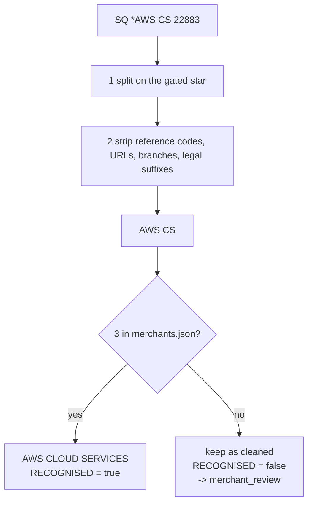
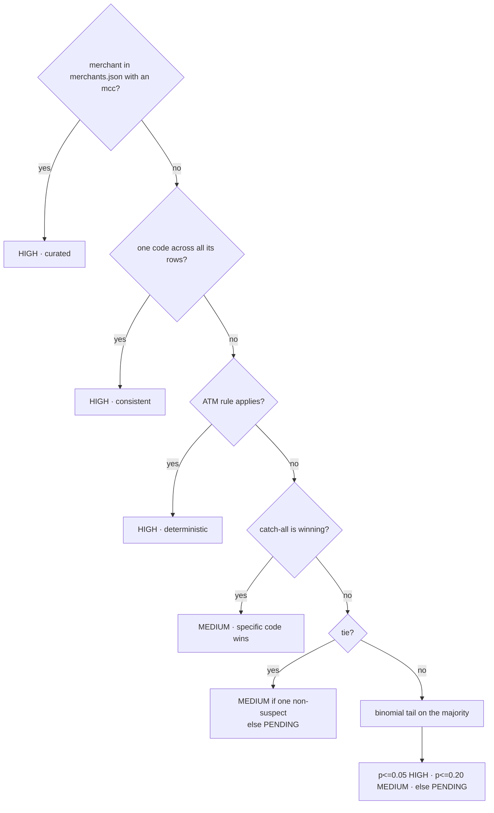

# Architecture

How each cleaning stage works, one stage per section. Every section follows the
same shape: **input → steps → output → the hard case**.

`README.md` says *what* the pipeline decided. This file says *how* each stage
reaches that decision.

---

## Table of contents

- [The shared contract](#the-shared-contract)
- [Execution order and why](#execution-order-and-why)
- [Stage 1 — Dates](#stage-1--dates)
- [Stage 2 — Duplicates](#stage-2--duplicates)
- [Stage 3 — Amounts](#stage-3--amounts)
- [Stage 4 — Codes](#stage-4--codes)
- [Stage 5 — Missing values](#stage-5--missing-values)
- [Stage 6 — Merchants](#stage-6--merchants)
- [Stage 7 — Cities](#stage-7--cities)
- [Stage 8 — MCC](#stage-8--mcc)
- [Stage 9 — Consistency](#stage-9--consistency)
- [Three rules that apply everywhere](#three-rules-that-apply-everywhere)
- [Adding a stage](#adding-a-stage)

---

## The shared contract

Every stage is a class with one method.

```python
class BaseCleaner(ABC):
    def apply(self, df: pd.DataFrame) -> pd.DataFrame: ...
    def log(self, metric: str, value) -> None: ...
```

| Rule | Why |
|---|---|
| Takes a frame, returns a **new** frame | The input is never mutated, so a stage can be rerun |
| Same shape for every stage | The pipeline holds them in a list and runs them without knowing what any does |
| Writes counts to one shared `CleaningReport` | A step that quietly nulls 400 rows looks identical to one that changed nothing |
| Steps are constructor arguments, not hardcoded | You can run one stage alone while developing it |

```python
TransactionCleaner(steps=[DateNormalizer]).run(df)   # one stage
TransactionCleaner().run(df)                         # all nine
```

---

## Execution order and why

Order is set by real data dependencies, not preference.


| Edge | Reason it cannot be reversed |
|---|---|
| Dates → Duplicates | Collisions are ordered by date; sorting mixed-format date *strings* orders garbage |
| Codes → Missing | Types must settle first, so "unreadable" is distinguishable from "absent" |
| Dates → Missing | `SETTLE_DATE_STATUS` needs a parsed date to call it anomalous |
| Merchants → MCC | MCC layers 3–5 group by the cleaned merchant name |
| Cities → Consistency | The geo check reads `MERCHANT_COUNTRY_EXPECTED` |
| everything → Consistency | It asserts across every derived column, so it runs last |

---

## Stage 1 — Dates

**In:** `TXN_DATE_TIME`, `SETTLE_DATE` — 5 formats across 2 columns
**Out:** `TXN_DATE_TIME_CLEANED`, `SETTLE_DATE_CLEANED` as `datetime64`

### Steps

1. Strip the value. If it matches a null token, return `None`.
2. Try each format **in a fixed order**; first regex match wins.
3. Parse with that format's `strptime`.
4. No match → `NaT`, and count it.

### The format table

Order matters. ISO comes first because `YYYY-MM-DD` and `MM-DD-YYYY` both use dashes.

| Format | Example | Rows |
|---|---|---|
| `iso_datetime` | `2022-03-10 00:51:36` | 1214 |
| `slash_day_first_datetime` | `09/07/2022 14:22` | 466 |
| `dash_month_first_datetime` | `04-22-2022 09:15` | 328 |
| `day_month_abbrev_datetime` | `10-Mar-22 00:51` | 175 |
| `epoch_millis` | `1646873496000` | 113 |

### The hard case: 604 ambiguous rows

`09/07/2022` — is that 9 July or 7 September?

**The separator decides.** It is a property of the exporter, verified before use:

```
'/' is day-first    630 unambiguous rows, 0 counterexamples
'-' is month-first  371 unambiguous rows, 0 counterexamples
```

> "Unambiguous" means one component is > 12, so only one reading is possible.

Never fall back to a guessing parser. An unparsed date means **a format we do not
handle yet** — a bug signal. Imputing it hides the bug, and next quarter's file
silently loses rows to a format nobody noticed.

**Result:** 0 unparseable, 14 placeholders (handled in stage 5).

---

## Stage 2 — Duplicates

**In:** the full frame
**Out:** same rows, plus `TXN_ID_SEQ`

### Two different defects, treated differently

| Case | Meaning | Action |
|---|---|---|
| Byte-identical row | double-load | **drop** |
| Same `TXN_ID`, different rows | upstream key fault | **keep both**, sequence them |

The second is never dropped — two rows sharing an ID may be two real
transactions with real amounts.

### Why a separate column

```python
df["TXN_ID_SEQ"] = 0        # 0 normally, 1..n on collision, ordered by date
```

Suffixing `TXN_ID` to `"4774694-2"` would flip the column's dtype from int to
string — **and only on files that happen to contain a collision.** Code that
works all year breaks in the one quarter that has a duplicate.

**Result:** 0 exact duplicates, 0 ID collisions, 0 business-key repeats. The
stage is a no-op on this file and exists for the next one.

---

## Stage 3 — Amounts

**In:** `TXN_AMOUNT` stored as **text**
**Out:** `TXN_AMOUNT_CLEANED` as float

### Three conventions in one column

| Input | Convention | Output |
|---|---|---|
| `(808.41)` | accounting negative | `-808.41` |
| `1,193.50` | comma thousands | `1193.50` |
| `5.727.580,00` | European decimal | `5727580.00` |
| `172,22` | **ambiguous** | depends on currency |

### Steps

1. Drop everything that is not a digit, separator, parenthesis or minus.
2. Parentheses or a leading `-` → negative.
3. **Both** separators present → the **last one** is the decimal point.
4. **One** separator → see below.

### The hard case: a lone comma

`172,22` could be 172.22 or 17222. Resolution order:

```
more than one occurrence          -> thousands       1,193,500
followed by exactly 3 digits      -> ask the currency
anything else                     -> decimal         172,22 -> 172.22
```

The currency is the tiebreaker because **a zero-decimal currency cannot have
minor units**:

```python
ZERO_DECIMAL = {"LBP", "JPY", "KRW", "VND", "IQD"}
```

So `5.727.580,00` under LBP is 5,727,580 — not 5.72.

**Result:** 0 unparseable, 15 reformatted.

---

## Stage 4 — Codes

**In:** `PROCESSING_CODE` (int), `MCC_CODE`
**Out:** `PROCESSING_CODE_CLEANED`, `PROCESSING_TYPE_CLEANED`, `MCC_CODE_CLEANED`, `MCC_CATEGORY`

### The principle

> A code spelled with digits is not a number. Arithmetic on it is meaningless
> and its leading zeros carry meaning, so its canonical form is a **string**.

An integer column destroyed the leading zeros. Padding restores them:

| Stored as int | ISO 8583 field 3 | Label | Rows |
|---|---|---|---|
| `0` | `00` | Purchase | 2112 |
| `1` | `01` | ATM Cash Withdrawal | 71 |
| `20` | `20` | Purchase Return/Refund | 113 |

> The full ISO field is 6 digits (type, from-account, to-account). This export
> carries only the leading transaction-type pair, hence width 2 and not 6.

### Labels are regenerated, never trusted

```python
labels = df["PROCESSING_CODE_CLEANED"].map(codes.get)
```

The incoming `PROCESSING_TYPE` text is not copied — it is **recomputed from the
code** and the old value compared against it. A future file spelling it `"ATM
WITHDRAWAL"` still lands on one canonical value, and the disagreement is counted.

**Result:** 0 unknown codes, 0 label disagreements, 41 distinct MCCs all present
in the reference.

> **Honest limit.** `PROCESSING_CODE` is 1:1 with `PROCESSING_TYPE` across all
> 2296 rows, zero disagreements. It is a join key with nothing to join to and a
> validation layer that never fires. Kept because a real switch keys on it.

---

## Stage 5 — Missing values

**In:** `TERMINAL_ID`, `AUTH_CODE`, `SETTLE_DATE_CLEANED`
**Out:** `HAS_TERMINAL`, `AUTH_CODE_VALID`, `SETTLE_DATE_STATUS`

### The whole policy follows from one split

| Kind | Meaning | Treatment |
|---|---|---|
| **Absent** | never recorded | leave null |
| **Unreadable** | present but unparseable | leave null, **always count** |
| **Not applicable** | legitimately has no value | keep the value, add a flag |

Collapsing "unreadable" into "absent" is the costly mistake — it turns a bug
signal into a silent gap.

### Per column

| Column | Count | Kind | Action |
|---|---|---|---|
| `TERMINAL_ID` = `00000000` | 1051 | not applicable | `HAS_TERMINAL = False` |
| `AUTH_CODE` sentinel/repeat | 109 | absent / invalid | `AUTH_CODE_VALID = False` |
| `SETTLE_DATE` | 14 | absent | `SETTLE_DATE_STATUS = UNKNOWN` |
| `MERCHANT_CITY` | 67 | absent | leave blank, no imputation |

### `TERMINAL_ID` at 46% is signal, not dirt

**0 of 71 ATM rows carry the sentinel** — an ATM is itself a terminal. So the
sentinel marks *card-not-present*, and imputing or dropping it would destroy the
card-present distinction.

### The hard case: nulls wearing three disguises

`SETTLE_DATE`'s 14 gaps arrive as:

```
blank        3    fails isna()  ✓
0000-00-00   9    MySQL zero-date   -- reads as an ordinary value
1970-01-01   2    epoch zero        -- reads as an ordinary value
```

Only the blanks fail an `isna()` check. The other 11 would have **parsed into
real 1970 dates**. So every disguise collapses to `NaT` *before* any other
decision, and "is it missing" then has exactly one answer in one place.

### Why the date stays null

The lag distribution looks safe to impute (0–4 days, mode 1, median 2). It is not:

- A +2 day estimate is right only **31.9%** of the time; the mode (+1) only 42%.
- The affected accounts settle at observably different speeds.
- `TXN_ID 4774694` is `Unmatched` — settlement is not even established, so an
  estimated date would assert an unevidenced event.

`SETTLE_DATE_STATUS` carries the state instead. Writing the string `"unknown"`
into the date column would be the **same defect as `0000-00-00`** — a text
placeholder in a date field, forcing the column to text.

### Auth codes: why any repeat is suspicious

```
6 alphanumeric chars  ->  ~2.2 billion combinations
across ~2300 rows     ->  ~0.001 expected genuine collisions
```

So a repeat is a planted value, not chance. Threshold is 2. **4 values repeat.**

---

## Stage 6 — Merchants

**In:** `MERCHANT_NAME` — the dirtiest column
**Out:** `MERCHANT_NAME_CLEANED`, `MERCHANT_PROCESSOR`, `MERCHANT_RECOGNISED`, `merchant_review` sheet

This stage has **two halves that must not be confused**: string cleaning, then a
lookup. Cleaning cannot finish the job, and no amount of extra regex changes that.



### Half 1 — string cleaning

#### The gated `*` split

The merchant sits on **either side** of the star:

```
SQ *TAKEALOT           -> processor left,  merchant right
COURSERA.COM *W2PA     -> merchant left,   ref code right
```

A blind split would corrupt **114 merchants**. So the split only fires when the
left token is on a whitelist:

```json
"prefixes": ["SQ", "IZ", "TST", "WPY", "SP", "PP", "PAYPAL", "GOOGLE"]
```

The whitelist was derived by frequency — a genuine processor precedes many
unrelated merchants, a merchant appears once:

```
SQ 83 · IZ 72 · TST 55 · WPY 45 · SP 42 · PP 39 · PAYPAL 36 · GOOGLE 35
114 tokens appearing exactly once (MALIK BKSHP, WAYFAIR.COM, FEDEX.COM …)
```

#### Then, in order

| Step | Removes | Example |
|---|---|---|
| `STAR_REF` | a **second** `*` + code | `DEUTSCHE BAHN *TNAS` → `DEUTSCHE BAHN` |
| `REF_SUFFIX` | `/xyz` | `AUTOZONE /lzx` → `AUTOZONE` |
| `URL_SUFFIX` | `.COM`, `.LB`, … | `COURSERA.COM` → `COURSERA` |
| `BRANCH` | numbered branch | `CREPAWAY BR 306` → `CREPAWAY` |
| `LEGAL` | `LTD`, `SARL`, … | `PARKING SERVICES LTD` → `PARKING SERVICES` |
| token filter | reference codes, store numbers | `REPSOL #70 *4GK9` → `REPSOL` |
| `TRAILING_BRANCH` | bare `BR` at the end | `AMERICAN UNIVERSITY BR` → `AMERICAN UNIVERSITY` |

The token filter is the subtle one:

```
mixes letters and digits  -> always a code       K0SA, 4GK9   drop
pure digits, not first    -> store number        #70, 3382    drop
pure digits, first        -> part of the name    7 ELEVEN     keep
```

### Half 2 — the merchant master

String cleaning gets variants *close* but never *equal*. One merchant arrives in
up to five forms:

| Form | Example |
|---|---|
| full | `WATERSTONES` |
| vowel-dropped | `WTRSTNS` |
| truncated | `YOUTUBE P` |
| space-stripped | `GOOGLEADS` |
| abbreviated | `CVS PHCY` |

So the final step is a **lookup, not a transformation**. `merchants.json` holds
one entry per merchant:

```json
"AWS CLOUD SERVICES": {
  "aliases": ["AWS CLOUD SERVI", "AWS CLOUD SVCS", "AWS CS", "AWSCLOUDSERVICES"],
  "note": "kept separate from AMAZON MARKETPLACE: same parent, different
           business (7372 vs 5999). MCC describes what was sold",
  "added_by": "Joseph Am-Makhlouf", "added": "2026-08-17"
}
```

**586 spellings → 270 merchants.** An unrecognised name is never guessed: it
keeps its cleaned form, `MERCHANT_RECOGNISED` goes false, and it enters
`merchant_review` with its raw spellings, countries and observed MCCs.

### The hard case: similarity is a hint, never the decision

Two traps that string distance gets wrong:

| Pair | Looks like | Actually |
|---|---|---|
| `WTRS` / `WTRSTNS` | one merchant | **Waitrose** 5411 grocery vs **Waterstones** 5942 books |
| `MEZYAN` / `MEZYANE` | one merchant | 5812 restaurant vs 5691 clothing, both LB |

Every merge was confirmed against **MCC + country**, not spelling. That is also
how `ADBL`→Audible (5815/US), `ATZN`→AutoZone (5533/US) and `CRM`→Careem
(4121/AE, *not* Crepaway 5812/LB) were settled.

Where the evidence disagreed, **nothing was asserted**: `TSC S` is 5411 in LB
while `SULTAN CENTER` is 5411 in KW, so it stays in review.

### Two naming rules

| Rule | Applied to |
|---|---|
| Brand relationship ≠ merchant identity | `AWS CLOUD SERVICES` stays separate from `AMAZON MARKETPLACE` |
| Country qualifiers are dropped | `CARREFOUR EGYPT`/`UAE`/`FRANCE` → `CARREFOUR`, since `MERCHANT_COUNTRY` carries geography |

One documented exception: `TOTAL LEBANON` keeps its suffix, because bare `TOTAL`
would collide with the unrelated `TOTAL WINE` and `TOTAL FITNESS CTR`.

---

## Stage 7 — Cities

**In:** `MERCHANT_CITY`, `MERCHANT_COUNTRY`
**Out:** `MERCHANT_CITY_CLEANED`, `IS_ECOMMERCE`, `MERCHANT_COUNTRY_EXPECTED`

### Steps

1. Uppercase, then map through `city_aliases.json`.
2. Mark `IS_ECOMMERCE` from the marker tokens **or** a missing terminal.
3. Look up the expected country in `city_countries.json`.

### Two kinds of variant collapse in one map

| Kind | Example | Rows |
|---|---|---|
| transliteration | `BEIRUT` / `BEIRUT LB` / `BEYROUTH` / `BEYRUT` | 329 |
| card-not-present marker | `INTERNET` / `ECOM` / `E-COMMERCE` | 1051 |

**128 distinct → 107.** Three merges were found only after the geo check below
made them visible, and each was confirmed by **shared merchants**, not spelling:

```
ASHRAFIEH  = ACHRAFIEH   (only ASHRAFIYA was listed)
JBEIL      = BYBLOS      Cave de Byblos, Gift Corner Jbeil appear under both
AL HAMRA   = HAMRA       Beauty Lounge Hamra, Mezyan appear under both
```

### The check: city implies country

A city sits in exactly one country, so the pair is verifiable. Before building
it, two things had to be established.

**1. Which field is wrong.** `CARREFOUR` settles it — it legitimately spans four
countries and its pairing is correct on every row:

```
ABU DHABI -> AE     CAIRO -> EG     PARIS -> FR     BEIRUT -> LB (7)
                                                    BEIRUT -> US (2)  <- noise
```

However, one limitation here could arise when facing a city that shares its name with other cities in different countries (e.g., Tripoli -> Lebanon/Libya).

> **The merchant's own modal country is not a usable witness.** `SNCF CONNECT`
> carries `PARIS`+GB five times against `PARIS`+FR once, so the mode reports GB
> for a French railway. The noise outvotes the truth.

**2. That it is noise, not unmodelled geography.** All 148 bad values come from a
set of four:

```
US 79 · TR 34 · GB 24 · IE 10
```

Real geography does not concentrate like that.

### Why the reference is asserted, not computed

`city_countries.json` states 105 city→country pairs rather than taking the modal
country at runtime. **Deriving the rule from the data it polices is circular**,
and it fails immediately: `DELFT` has one row, an IKEA transaction tagged SE, so
the mode would place a Dutch city in Sweden.

All 105 were hand-checked; that was the only one the mode got wrong.

### `INTERNET` + `LB` is not an error

The marker sits in the *city* field; the country still describes where the
merchant is registered. So `INTERNET`+`LB` reads "online purchase from a
Lebanon-registered merchant" and nothing conflicts. Those rows get a **blank**
expectation and are never flagged.

> Not knowing where a merchant is differs from placing it in the wrong country.
> Only the second is a defect.

### Blank cities are not imputed

Country does not determine city, so there is nothing to derive from. Only 18 of
the 67 are card-not-present, so "it's e-commerce" does not explain the rest —
and for those 18, `IS_ECOMMERCE` already carries the fact. Writing `INTERNET`
into a city column would encode the same thing twice, in a fake location.

---

## Stage 8 — MCC

**In:** `MCC_CODE_CLEANED`, `MERCHANT_NAME_CLEANED`, `PROCESSING_TYPE`
**Out:** `MCC_CODE_SUGGESTED`, `MCC_CONFIDENCE`, `mcc_review` sheet

The workbook's second sheet is a 41-entry `MCC_CODE → CATEGORY` reference. That
turns MCC into an independently verifiable field.

### Signals, in strict priority order



| # | Signal | Basis |
|---|---|---|
| 0 | **Curated** | A human `mcc` in `merchants.json`. Beats everything |
| 1 | **Consistent** | One code across every row. Nothing disagrees |
| 2 | **Deterministic** | The reference labels `6011` *"ATM Cash Withdrawal"* — the exact string `PROCESSING_TYPE` uses |
| 3 | **Catch-all override** | `5999` is a bucket with no meaning, so a specific code beats it *regardless of count* |
| 4 | **Suspect tiebreak** | On a tie, a specific code beats `5812`/`5817` |
| 5 | **Majority** | Scored by a binomial tail, giving a real p-value |

### Signal 2 is the strongest, because it needs no merchant cleaning

```
71 ATM Cash Withdrawal rows  ->  65 carry MCC 6011
                                  5 carry 5999
                                  1 carries 5812     = 6 violations
```

### Signal 3 is the one that matters most

Majority vote returns **flatly wrong** answers on this data:

```
USJ BEIRUT   5999:7  8220:3   ->  vote says "Miscellaneous Retail" for a university
```

The rule flips it to `8220 Colleges, Universities`. Rationale:

> **`5999` is a bucket, not a category.** It is what an acquirer assigns when it
> does not know. It carries no positive information, so it can never win.

Applies to 30 merchants:

```
BOOTS PHARMACY 5999:5 5912:3 -> 5912 Drug Stores
OGERO          5999:4 4814:3 -> 4814 Telecommunication Services
DHL EXPRESS    5999:3 4215:2 -> 4215 Courier Services
ZARA           5999:4 5651:2 -> 5651 Family Clothing
```

### Not every suspect code is the same kind

| Code | Nature | Treatment |
|---|---|---|
| `5999` Misc Retail | pure bucket | never wins |
| `5812` Eating Places | **real category** also used as noise | only loses head-to-head |
| `5817` Digital Goods | **rail artifact** — see below | only loses head-to-head |

`PRET A MANGER` is `5812:8 / 5999:3` and genuinely *is* a restaurant. Demoting
5812 by identity would punish a correct answer.

**`5817` has a mechanical explanation.** All 26 rows carrying it are
Google-Pay-prefixed — **26 of 26**. The acquirer stamps that rail as *Digital
Goods, Applications* regardless of merchant (Ryanair, Carrefour, AXA, Avis). It
is not a category judgement at all.

### Confidence: three states

Three, because three is what a reader can act on.

| State | Meaning | Rows |
|---|---|---|
| `HIGH` | settled — curated, consistent, deterministic, or p ≤ 0.05 | 2230 |
| `MEDIUM` | inferred — catch-all override, tiebreak, or p ≤ 0.20 | 58 |
| `PENDING` | a human still has to decide | 8 |

Provenance is not lost to the collapse — it is logged:

```
signal[curated]     1222      signal[unresolved_tie]        8
signal[consistent]   973      signal[catch_all_override]    7
signal[majority]      80      signal[deterministic]         6
```

### Only PENDING reaches the review queue

**1 merchant** on this file: `ABC VERDUN` (`5812:4 / 5999:4`), a Beirut mall
where food court versus mixed retail is a genuine judgement call.

> A queue listing resolved items trains reviewers to skim it, which is how the
> one row that needs a decision gets missed.

### The known failure mode

The catch-all rule assumes the specific code is true. That breaks when the
merchant genuinely *is* miscellaneous retail:

```
NOON COM   5999:6  5812:4   ->  rule would wrongly suggest "Eating Places"
```

`NOON COM` is a general marketplace, so it is **pinned** to 5999 in
`merchants.json`. This is exactly why signal output is a review queue and never
an auto-applied repair.

### Why not a model

| Objection | Detail |
|---|---|
| It would not solve it | `USJ` fails because identifying it needs *entity knowledge* — that USJ is Université Saint-Joseph. Embeddings of "USJ BEIRUT" and "Colleges, Universities" are not close |
| It breaks auditability | "Why did this merchant get this MCC" stops having a stable answer |

The better answer is **reference data, not inference**: an internal merchant
master is authoritative and needs no guessing.

---

## Stage 9 — Consistency

**In:** every derived column
**Out:** `VALIDATION_FLAGS` — changes no data

### The idea

The dataset states some facts more than once. Redundancy becomes the validation
layer rather than something to collapse.

| Flag | Rule | Hits |
|---|---|---|
| `REQUIRED_NULL[…]` | 5 columns that make a row unusable if null | 0 |
| `SETTLE_BEFORE_TXN` | `SETTLE_DATE < TXN_DATE` | 6 |
| `GEO_CITY_COUNTRY_MISMATCH` | city implies a different country | 148 |
| `REFUND_NEGATIVE` | refund with a negative billing amount | 0 |
| `PURCHASE_POSITIVE` | purchase with a positive billing amount | 0 |
| `CODE_TYPE_MISMATCH` | label disagrees with its code | 0 |
| `MCC_ATM_MISMATCH` | raised in stage 8 | 6 |

**157 rows carry at least one flag.**

### Flags accumulate, they do not overwrite

```python
flags = existing.map(lambda v: [f for f in str(v).split(";") if f])
```

Stage 8 already wrote `MCC_ATM_MISMATCH`. Starting from a blank column here
would silently erase it.

### Why flag and not fix

The 6 impossible settlement dates settle **one day before** the transaction. All
are `Match`/`Settled` with times spread across the day, so a timezone boundary
does not explain them.

> We cannot know **which of the two dates is wrong**, so correcting either would
> be a guess.

### The one legitimate reason to drop a row

A null in the required set — `TXN_ID`, `ACCOUNT_ID`, `TXN_DATE_TIME`,
`TXN_AMOUNT`, `TXN_CCY`. This file has none. That is a hard failure, not a
cleaning task.

No row is ever dropped for a null anywhere else. Deleting 67 complete
transactions to fix one descriptive field would destroy more than it repairs.

---

## Three rules that apply everywhere

### 1. Never overwrite a source column

Every stage adds `*_CLEAN` beside the original. Applied without exception:

| Field | Original | Derived |
|---|---|---|
| Amount | `TXN_AMOUNT` (text) | `TXN_AMOUNT_CLEANED` (float) |
| MCC | `MCC_CODE` | `MCC_CODE_SUGGESTED` + `MCC_CONFIDENCE` |
| Country | `MERCHANT_COUNTRY` | `MERCHANT_COUNTRY_EXPECTED` |
| Settlement | `SETTLE_DATE` | `SETTLE_DATE_CLEANED` + `SETTLE_DATE_STATUS` |

`raw_transactions` ships all 19 source columns byte-for-byte, joinable on
`TXN_ID`, so the workbook is self-auditing. The cleaned sheets then show **only**
the cleaned columns — a text `TXN_AMOUNT` beside a float one invites a total
computed from the wrong column.

### 2. Rules in JSON, logic in Python

| File | Holds |
|---|---|
| `processors.json` | processor prefixes |
| `date_formats.json` | format patterns + null tokens |
| `processing_codes.json` | ISO codes → labels |
| `city_aliases.json` | city spellings + e-commerce markers |
| `city_countries.json` | 105 city → country |
| `mcc_rules.json` | catch-all, suspect codes, thresholds |
| `merchants.json` | 270 merchants, 336 aliases, 137 asserted MCCs |

Vocabularies change as new data arrives; the code applying them does not.
Updating a vocabulary needs no logic review, and non-engineers can read it.

They live **inside** the package, because `pip install` would leave them behind
otherwise and every import would break in production.

### 3. Dates are datetimes until the moment of writing

Held as `datetime64` in the frame; `dd-mm-yyyy hh:mm:ss` is applied only in
`write_workbook`. As text, `"09-07-2022"` sorts before `"10-01-2021"` because
strings compare character by character, and every sort, filter and date
calculation silently breaks.

---

## Adding a stage

1. Subclass `BaseCleaner`, implement `apply`, set `name`.
2. Put any vocabulary in `rules/json/` and add a `loader` function.
3. Insert it in `DEFAULT_STEPS` at the point its dependencies allow.
4. If it produces a review queue, expose `review_queue()` and add the sheet in
   `build_sheets`.
5. Add derived columns to `PRESENTATION_ORDER` in `utils/columns.py`.

The orchestrator needs no edit — it holds steps in a list and runs them.

### What a test should assert

| Assert | Not |
|---|---|
| the awkward real values from this file | invented round numbers |
| a planted violation is caught | that the count is currently 0 |
| every rule-file key still matches a live row | that the file parses |

The staleness guards matter most: `merchants.json` keys match *cleaned* names,
which shift as `MerchantCleaner` improves, so a dead entry must fail a test
rather than silently do nothing.
