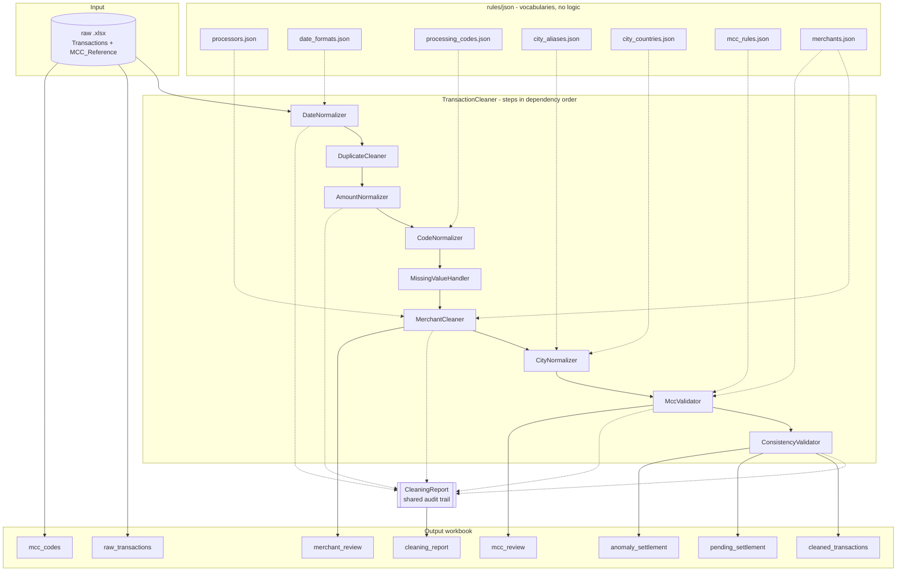

# Transaction Cleaning Pipeline

> As part of the onboarding I have been tasked to clean the following data (I have noticed many of the cleaning steps are also done in the transaction categorization pipeline).

A class-based cleaning pipeline for a 2,296-row card transactions workbook, exposing one importable function and emitting a multi-sheet workbook that behaves like a small database.

---

## Table of contents

- [Quick start](#quick-start)
- [Architecture](#architecture)
- [Output workbook](#output-workbook)
- [Pipeline reasoning](#pipeline-reasoning)
  - [1. Dates](#1-dates)
  - [2. Duplicates](#2-duplicates)
  - [3. Amounts](#3-amounts)
  - [4. Codes](#4-codes)
  - [5. Missing values](#5-missing-values)
  - [6. Merchants](#6-merchants)
  - [7. Cities](#7-cities)
  - [8. MCC validation](#8-mcc-validation)
  - [9. Consistency](#9-consistency)
- [Cross-cutting decisions](#cross-cutting-decisions)
- [Results on the source file](#results-on-the-source-file)
- [Rule files](#rule-files)
- [Testing](#testing)
- [Future work](#future-work)
- [Reference documents](#reference-documents)

---

## Quick start

Install the package and its dependencies in editable mode.

```bash
python -m pip install -e ".[dev]"
```

Run the pipeline against the bundled source file.

```bash
clean-transactions
```

Run the read-only profiler to inspect a file before cleaning it.

```bash
python -m cleaning_task.profiling.profiler
```

Run the test suite.

```bash
python -m pytest -q
```

PowerShell equivalents, if the console script is not on `PATH`:

```powershell
python -m pip install -e ".[dev]"
python -c "from cleaning_task.main import main; main()"
python -m pytest -q
```

Use it from anywhere as a library.

```python
from cleaning_task import clean_transactions

cleaned, report = clean_transactions(
    "data/raw/synthetic_dirty_transactions_v4.xlsx",
    output_path="data/output/cleaned_transactions.xlsx",
)
print(report)
```

`clean_transactions` accepts a path or an in-memory DataFrame, so the same call works against a workbook now and a database extract later.

---

## Architecture



Step order follows real dependencies, not preference: `DateNormalizer` precedes `DuplicateCleaner` because ID collisions are sequenced by date, and sorting mixed-format date *strings* orders garbage; `MccValidator` follows `MerchantCleaner` because it groups by the cleaned merchant name.

---

## Output workbook

| Sheet | Rows | Contents |
|---|---|---|
| `raw_transactions` | 2296 | Source, untouched, so any cleaned value is traceable without opening the original file. |
| `cleaned_transactions` | 2296 | Cleaned columns only; a raw column is dropped once a cleaned one supersedes it. |
| `mcc_codes` | 41 | The MCC reference, carried through as a joinable lookup. |
| `pending_settlement` | 14 | Rows whose settlement date is unavailable. |
| `anomaly_settlement` | 6 | Rows where settlement precedes the transaction. |
| `merchant_review` | 0 | Merchant names absent from the master — the ones a future file will surface. |
| `mcc_review` | 11 | Merchants with unresolved MCC conflicts to be manually reviewed. |
| `cleaning_report` | 58 | Every metric the run recorded. |

The last three sheets **mirror** rows rather than moving them, because removing real transactions to isolate a date problem would corrupt every total computed from the main table.

---

## Pipeline reasoning

### 1. Dates

Five formats appear across two columns, and 604 rows are ambiguous between day-first and month-first. The separator resolves them: `/` is day-first in 630 unambiguous rows with zero counterexamples, `-` is month-first in 371 with zero counterexamples. Formats are tried in a fixed order and anything unmatched becomes `NaT` and is counted, because an unparsed date means a format we do not handle yet, which is a bug signal rather than a missing value.

### 2. Duplicates

Byte-identical rows are dropped, but `TXN_ID` collisions are not: two different rows sharing an ID may be two real transactions mislabelled upstream. Those are sequenced in a separate `TXN_ID_SEQ` integer column rather than by suffixing the ID, which would flip the column's dtype to string and only on files that happen to contain a collision.

### 3. Amounts

`TXN_AMOUNT` is stored as text and mixes three conventions: accounting negatives `(808.41)`, thousands separators `1,193.50`, and European decimals `5.727.580,00`. Where both separators appear the last one is the decimal point; where a single comma precedes exactly three digits the value is genuinely ambiguous, so the currency decides — a zero-decimal currency like LBP can only be using it as a thousands separator.

### 4. Codes

A code spelled with digits is not a number: arithmetic on it is meaningless and its leading zeros carry meaning, so `PROCESSING_CODE` is emitted as a fixed-width string that restores the `00`/`01` an integer column destroyed. The label is regenerated from the code through a lookup rather than trusted from the source, so a future file spelling it differently still lands on one canonical value.

### 5. Missing values

Three kinds of missing are kept apart: **absent** stays null, **unreadable** stays null and is counted, and **not applicable** keeps its value and gains a flag. `TERMINAL_ID` `00000000` is the third kind — 0 of 71 ATM rows carry it, because an ATM is itself a terminal, so it marks card-not-present rather than data loss. `SETTLE_DATE` gaps wear three disguises (blank, `0000-00-00`, `1970-01-01`) and all collapse to one null before any decision, with `SETTLE_DATE_STATUS` carrying `UNKNOWN` because a literal `"unknown"` string would force the date column to text.

### 6. Merchants

The `*` split is gated on a processor whitelist because the merchant sits on either side — `SQ *TAKEALOT` puts it on the right, `COURSERA.COM *W2PA` on the left — so a blind split would corrupt 114 merchants. The whitelist was derived by frequency: a genuine processor precedes many unrelated merchants, a merchant appears once.

String cleaning alone cannot finish the job. One merchant arrives in up to five forms — full (`WATERSTONES`), vowel-dropped (`WTRSTNS`), truncated (`YOUTUBE P`), space-stripped (`GOOGLEADS`) and abbreviated (`CVS PHCY`) — and no amount of normalisation makes `AWS CS` equal `AWSCLOUDSERVICES`. So the last step is a lookup, not a transformation: **`merchants.json` is the merchant master**, one entry per merchant keyed by canonical name, with every observed spelling listed under `aliases`. 586 cleaned spellings resolve to 270 merchants.

A name matching neither a key nor an alias is **not guessed at**. It keeps its cleaned form, `MERCHANT_RECOGNISED` goes false, and it appears in the `merchant_review` sheet with its raw spellings, countries and observed MCCs — the evidence a reviewer needs to decide whether it is a new merchant or another variant of a known one. Today that sheet is empty because the master covers this file completely; its job starts with the next one.

Similarity is a hint, never the decision. Two traps in this file make the point:

- `WTRS` and `WTRSTNS` differ by three characters, and are **Waitrose** (5411, grocery, GB) and **Waterstones** (5942, books, GB) — different merchants. String distance merges them; MCC separates them.
- `MEZYAN` and `MEZYANE` differ by one character, and are 5812 (restaurant) and 5691 (clothing), both in Lebanon.

Every merge was confirmed against MCC and country rather than spelling, which is also how `ADBL`→Audible, `ATZN`→AutoZone and `CRM`→Careem (not Crepaway) were settled. Where the evidence disagreed — `TSC S` is 5411 in **LB** while `SULTAN CENTER` is 5411 in **KW** — no assertion was made.

Brand relationships are not merchant identity: `AWS CLOUD SERVICES` (7372) stays separate from `AMAZON MARKETPLACE` (5999) despite the shared parent, because MCC describes what was sold. Country qualifiers go the other way and are dropped — `CARREFOUR EGYPT`/`UAE`/`FRANCE` all fold into `CARREFOUR`, since `MERCHANT_COUNTRY` already carries the geography. The exception is `TOTAL LEBANON`, which keeps its suffix because bare `TOTAL` would collide with the unrelated `TOTAL WINE` and `TOTAL FITNESS CTR`.

### 7. Cities

Four spellings of Beirut cover 329 rows and three tokens mean card-not-present, so both collapse through an alias map. Blank cities are left blank, because country does not determine city and filling the modal value would fabricate location data.

Three more variants were folded in after the city/country check below made them visible: `ASHRAFIEH` was missing beside `ASHRAFIYA`, and `JBEIL`/`BYBLOS` and `HAMRA`/`AL HAMRA` are each one place under two names — confirmed not by spelling but by the merchants appearing under both.

**City and country disagree on 148 rows,** and the disagreement is one-sided. A city sits in exactly one country, so the pair is checkable: `city_countries.json` asserts the mapping and `MERCHANT_COUNTRY_EXPECTED` carries it per row. Two things had to be established before the check was worth making.

*Which field is wrong.* `CARREFOUR` settles it — it legitimately spans four countries, and its city→country pairing is correct on every row (`ABU DHABI`→AE, `CAIRO`→EG, `PARIS`→FR, `BEIRUT`→LB) with a tail of 2 rows saying US. The city is reliable; the country is not. Note the merchant's *own* modal country is not a usable witness: `SNCF CONNECT` carries `PARIS`+GB five times against `PARIS`+FR once, so the noise outvotes the truth and the mode reports GB for a French railway.

*That it is noise rather than unmodelled geography.* Every one of the 148 bad values is drawn from a set of four — **US 79, TR 34, GB 24, IE 10**. Real geography does not concentrate like that.

The reference is asserted in JSON rather than computed from the modal country at runtime, which is not a formality: `DELFT` has one row, an IKEA transaction tagged SE, so the mode would have placed a Dutch city in Sweden. Deriving the rule from the data it is meant to police is circular, and here it fails on the first city with thin evidence.

`MERCHANT_COUNTRY` is never overwritten — the mismatch is written to `VALIDATION_FLAGS` as `GEO_CITY_COUNTRY_MISMATCH`, same discipline as MCC and the settlement date.

**`INTERNET`, `ECOM` and `E-COMMERCE` paired with a country are not errors.** Those tokens are card-not-present markers sitting in the city field; the country still describes where the merchant is registered, so `INTERNET`+`LB` says "online purchase from a Lebanon-registered merchant" and nothing is in conflict. Those 1051 rows produce a blank `MERCHANT_COUNTRY_EXPECTED` and are never flagged. Not knowing where a merchant is differs from placing it in the wrong country, and only the second is a defect.

### 8. MCC validation

Six signals in priority order, none of which ever overwrites `MCC_CODE`:

| Priority | Signal | Basis |
|---|---|---|
| 0 | Curated override | A human-asserted `mcc` in `merchants.json`. |
| 1 | Deterministic rule | The reference labels `6011` "ATM Cash Withdrawal", the exact string `PROCESSING_TYPE` uses. |
| 2 | Catch-all override | `5999` is a bucket with no positive meaning, so a specific code beats it regardless of count. |
| 3 | Suspect tiebreak | On a tie, a specific code beats `5812`/`5817`, which are real categories also used as noise. |
| 4 | Majority vote | Scored by a binomial tail against "codes assigned at random", giving a p-value rather than an invented threshold. |
| 5 | Review queue | Anything unresolved goes to a human. |

Priority 2 exists because majority vote returns flatly wrong answers: `USJ BEIRUT` carries `5999:7 / 8220:3`, so the noise code wins the vote 7–3 and every frequency-based method would label a university "Miscellaneous Retail".

### 9. Consistency

The dataset states the same fact three ways — processing code, processing type, and the sign of the billing amount — so any disagreement means one of them is corrupt. Violations are appended to `VALIDATION_FLAGS` per row and never silently repaired, because correcting a `SETTLE_DATE < TXN_DATE` pair would require guessing which of the two dates is wrong.

---

## Cross-cutting decisions

**Originals are never mutated.** All source columns pass through under their own names and cleaned values arrive as `*_CLEAN`, so existing consumers keep working and "why did this become that" stays answerable.

**Dates live as `datetime64` and are formatted only on write.** Held as text, `"09-07-2022"` sorts before `"10-01-2021"` because strings compare character by character, so every sort and date filter would silently break.

**Nothing is repaired in place.** Derived values are offered as suggestions with a confidence tier; the pipeline flags and proposes, a human decides.

**Rules are JSON, logic is Python.** Vocabularies change as new data arrives; the code applying them does not, so updating one never requires re-reviewing the other.

**Every step writes to one shared report.** Without it, a step that quietly nulls 400 rows is indistinguishable from one that changed nothing.

---

## Results on the source file

| Check | Result |
|---|---|
| Rows in / out | 2296 / 2296 |
| Dates unparsed | 0 of 4,592 values |
| Amounts unparsed | 0 (15 reformatted) |
| Duplicates | 0 exact, 0 ID collisions, 0 business-key repeats |
| Settlement unknown | 14 (3 blank, 9 `0000-00-00`, 2 `1970-01-01`) |
| Settlement anomalous | 6 (`SETTLE_DATE < TXN_DATE`) |
| Terminal sentinels | 1051 flagged, none erased |
| Auth codes invalid | 109 (71 sentinel + 38 improbable repeats) |
| Cities | 128 distinct → 107 |
| Merchants | 586 cleaned spellings → 270 merchants, 0 unrecognised |
| City/country mismatch | 148 (all from US/TR/GB/IE) |
| MCC conflicts | 137 curated, 11 in review |
| MCC ATM violations | 6 |
| Rows flagged | 157 |

---

## Rule files

| File | Contents |
|---|---|
| `processors.json` | Payment-processor prefixes that gate the `*` split. |
| `date_formats.json` | Ordered format patterns plus date-shaped null tokens. |
| `processing_codes.json` | ISO 8583 transaction-type codes and labels. |
| `city_aliases.json` | Canonical city spellings and e-commerce markers. |
| `city_countries.json` | 105 cities and the country each sits in, for the geo check. |
| `mcc_rules.json` | Catch-all code, suspect codes, deterministic rules, thresholds. |
| `merchants.json` | The merchant master: 270 merchants, 336 alias spellings, 137 asserted MCCs. |

Every entry carries `added_by`, `added` and usually a `note`, so a year from now a verified fact is still distinguishable from a guess.

---

## Testing

```bash
python -m pytest -q
```

71 tests, table-driven from the awkward values in the real file rather than invented ones. Coverage concentrates on the row-level pure functions where the tricky logic lives — the separator rule, the amount conventions, the gated `*` split, the confidence tiers — plus override hygiene: every entry must carry provenance, name a valid MCC, and still match a live merchant, so a stale entry fails a test instead of silently doing nothing.

---

## Future work

**Resolve the settlement-date question.** The 14 unknown dates are left null pending a domain answer on whether the column drives chargeback windows, statement periods, or regulatory reporting, and whether the source can simply be re-queried. The full argument is in `SETTLE_DATE_IMPUTATION.md`.

**Replace curated overrides with internal reference data.** An existing merchant master or the transaction-categorization pipeline's own merchant→category mapping would be authoritative and inside the security perimeter, making layers 2–4 of the MCC validator largely redundant.

**Extend the MCC reference.** Car rental (`7512` in ISO 18245) is absent, so `AVIS` and `HRTZ` are recorded under `7538` Automotive Service Shops by convention rather than correctness.

**Port to Spark.** The cleaners are pure row-level functions over a DataFrame, so the pipeline shape transfers; `MerchantCleaner.clean_one` is already a static method suitable for a UDF or `pandas_udf`.

**Widen the ISO processing code.** Field 3 is six digits in full — transaction type, from-account, to-account — and this source carries only the leading pair, so `PROCESSING_CODE_WIDTH` needs revisiting against a real ISO feed.

**Improve merchant grouping.** `THE BODY SHOP` currently cleans to `THE BODY` because branch-number stripping removes the trailing token, which is harmless here but shows the rule is blunter than it should be.

**Add a merchant alias layer.** Abbreviated names (`USJ`, `RPSL`, `STRBCKS`) are entity-knowledge problems that no text model solves, so they need a lookup that grows as names are identified.

---

## Reference documents

| Document | Contents |
|---|---|
| `PLAN.md` | Full architecture, EDA findings, phased plan, and the reasoning behind each decision. |
| `SETTLE_DATE_IMPUTATION.md` | Standalone decision memo on whether missing settlement dates should be imputed. |
