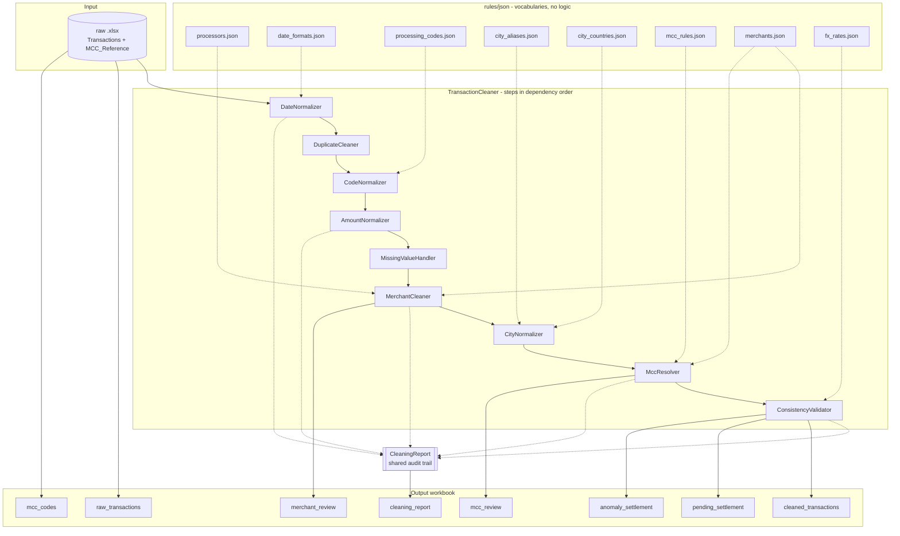

# Transaction Cleaning Pipeline

_This task was realized as part of the Onboarding at X-Tends' Machine Learning Team by Joseph Am-Makhlouf_

A class-based cleaning pipeline for a 2,296-row card transactions workbook, exposing one importable function and emitting a multi-sheet workbook that behaves like a small database.

This file covers what the pipeline is, how to run it, and what it produced. Every *why* - the reasoning behind each cleaning decision - lives in [`ARCHITECTURE.md`](ARCHITECTURE.md), one section per stage.

---

## Quick start

Create the virtual environment and install the dependencies.

```powershell
python -m venv .venv
.venv\Scripts\Activate.ps1
python -m pip install -r requirements-dev.txt
```

On macOS or Linux the activation line is `source .venv/bin/activate`; everything after it is identical.

Run the pipeline against the bundled source file.

```bash
make run
```

Run the test suite.

```bash
make test
```
N.B.: Make sure to download 'make' beforehand. One way of doing that is running the following command in powershell:  
```bash
choco install make
```

Run the read-only profiler to inspect a file before cleaning it.

```bash
python -m eda.profiler
```

Both `make` targets are one-line wrappers, so the direct equivalents work identically on any shell.

```powershell
python main.py
python -m pytest -q
```

`src/` holds the steps, the orchestrator and the report; `main.py` at the repo root is the entry point that composes them.

## Shape



| Stage | What it does | Reasoning |
|---|---|---|
| 1. Dates | Parses five formats across two columns into `datetime64` | [Stage 1](ARCHITECTURE.md#stage-1--dates) |
| 2. Duplicates | Drops identical rows; sequences `TXN_ID` collisions | [Stage 2](ARCHITECTURE.md#stage-2--duplicates) |
| 3. Codes | Restores leading zeros; regenerates labels from a lookup | [Stage 3](ARCHITECTURE.md#stage-3--codes) |
| 4. Amounts | Parses text amounts to float and signs them by transaction type | [Stage 4](ARCHITECTURE.md#stage-4--amounts) |
| 5. Missing values | Separates absent, unreadable and not-applicable | [Stage 5](ARCHITECTURE.md#stage-5--missing-values) |
| 6. Merchants | Cleans names, then resolves them against a curated master | [Stage 6](ARCHITECTURE.md#stage-6--merchants) |
| 7. Cities | Collapses city variants; checks the country each implies | [Stage 7](ARCHITECTURE.md#stage-7--cities) |
| 8. MCC | Assigns a code and a confidence tier from five ranked signals | [Stage 8](ARCHITECTURE.md#stage-8--mcc) |
| 9. Consistency | Asserts the redundant encodings still agree | [Stage 9](ARCHITECTURE.md#stage-9--consistency) |

Step order follows real dependencies rather than preference; [Execution order and why](ARCHITECTURE.md#execution-order-and-why) lists each edge and what breaks if it is reversed.

---

## Output workbook

| Sheet | Rows | Contents |
|---|---|---|
| `raw_transactions` | 2296 | Source, untouched, so any cleaned value is traceable without opening the original file. |
| `cleaned_transactions` | 2296 | Cleaned columns only; a raw column is dropped once a cleaned one supersedes it. |
| `processing_codes` | 3 | Transaction-type codes, as a joinable lookup. |
| `mcc_codes` | 41 | The MCC reference, carried through as a joinable lookup. |
| `pending_settlement` | 14 | Rows whose settlement date is unavailable. |
| `anomaly_settlement` | 6 | Rows where settlement precedes the transaction. |
| `merchant_review` | 0 | Merchant names absent from the master — the ones a future file will surface. |
| `mcc_review` | 11 | Merchants with unresolved MCC conflicts to be manually reviewed. |
| `cleaning_report` | 67 | Every metric the run recorded. |

The settlement and review sheets **mirror** rows rather than moving them, because removing real transactions to isolate a date problem would corrupt every total computed from the main table.

Column names are **lowercase** throughout, because an unquoted identifier folds to lowercase in Postgres and DuckDB anyway, so these names survive a load without quoting. Every cleaned column keeps a `_cleaned` suffix: `txn_amount_cleaned` is the parsed float, `txn_amount` on `raw_transactions` is the text the source held. `matches_status` is the one exception: it is not a repair of the incoming status but a fresh verdict, recomputed against the current merchant master, so the suffix would claim a provenance it does not have.

---

## Results on the source file

| Check | Result |
|---|---|
| Rows in / out | 2296 / 2296 |
| Dates unparsed | 0 of 4,592 values |
| Amounts unparsed | 0 (15 reformatted) |
| Amount signs restored | 13 (purchases whose text amount had no minus) |
| Duplicates | 0 exact, 0 ID collisions, 0 business-key repeats |
| Settlement unknown | 14 (3 blank, 9 `0000-00-00`, 2 `1970-01-01`) |
| Settlement anomalous | 6 (`SETTLE_DATE < TXN_DATE`) |
| Terminal sentinels | 1051 flagged, none erased |
| Auth codes invalid | 109 (71 sentinel + 38 improbable repeats) |
| Cities | 128 distinct → 107 |
| Merchants | 586 cleaned spellings → 270 merchants, 0 unrecognised |
| City/country mismatch | 148 (all from US/TR/GB/IE) |
| MCC conflicts | 137 curated, 11 in review |
| MCC ATM violations | 6 |
| FX reconciliation failures | 48 (23 of them a billing amount 1/100 too small) |
| FX rates off reference | 481, all LBP (100 still on the 1507.5 peg) |
| Rows flagged | 643 |

Every number here comes from `cleaning_report`.

---

## Rule files

Vocabularies live in `src/rules/json/` as data, never as code, so updating one never requires re-reviewing the logic that applies it.

| File | Contents |
|---|---|
| `date_formats.json` | Ordered format list and the tokens that mean null. |
| `processors.json` | Payment-processor prefixes that gate the `*` split. |
| `processing_codes.json` | Transaction-type codes and labels. |
| `fx_rates.json` | One reference rate per currency, as units per USD. |
| `city_aliases.json` | City variant spellings → canonical name. |
| `city_countries.json` | Canonical city → the country it sits in. |
| `merchants.json` | The merchant master: canonical names, aliases, curated MCCs. |
| `mcc_rules.json` | Deterministic MCC rules and the catch-all codes. |

---

## Testing

```bash
make test
```

121 tests, table-driven from the awkward values in the real file rather than invented ones. They fall into four groups: the row-level parsing rules, the policies those rules exist to serve, staleness guards on the JSON rule files, and the output contract. [What a test should assert](ARCHITECTURE.md#what-a-test-should-assert) explains the distinction the suite is built on.

---

## Future work

**Resolve the settlement-date question.** The 14 unknown dates are left null pending a domain answer on whether the column drives chargeback windows, statement periods, or regulatory reporting, and whether the source can simply be re-queried.

**Replace curated overrides with internal reference data.** An existing merchant master or the transaction-categorization pipeline's own merchant→category mapping would be authoritative and inside the security perimeter, making layers 2–4 of the MCC resolver largely redundant.

**Extend the MCC reference.** Car rental (`7512` in ISO 18245) is absent, so `AVIS` and `HRTZ` are recorded under `7538` Automotive Service Shops by convention rather than correctness.

**Improve merchant grouping.** `THE BODY SHOP` currently cleans to `THE BODY` because branch-number stripping removes the trailing token, which is harmless here but shows the rule is blunter than it should be.

**Add a merchant alias layer.** Abbreviated names (`USJ`, `RPSL`, `STRBCKS`) are entity-knowledge problems that no text model solves, so they need a lookup that grows as names are identified.
