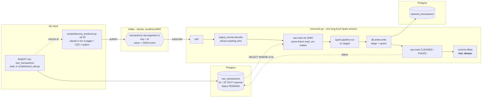
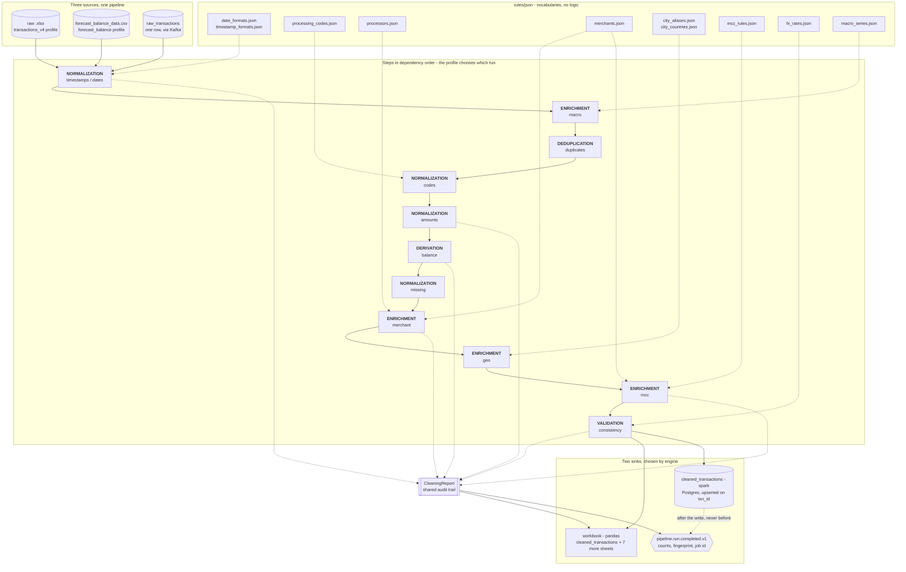

# Transaction Cleaning Pipeline

_This task was realized as part of the Onboarding at X-Tends' Machine Learning Team by Joseph Am-Makhlouf_

A class-based cleaning pipeline for a 2,296-row card transactions workbook, exposing one importable function and emitting a multi-sheet workbook that behaves like a small database.

This file covers what the pipeline is, how to run it, and what it produced. Every *why* - the reasoning behind each cleaning decision - lives in [`ARCHITECTURE.md`](ARCHITECTURE.md), one section per stage.

---

## Quick start

Create the virtual environment and install the dependencies.

```powershell
python -m venv .venv
.venv\Scripts\Activate.ps1
python -m pip install -r requirements-dev.txt
```

On macOS or Linux the activation line is `source .venv/bin/activate`; everything after it is identical.

Run the pipeline against the bundled source file.

```bash
make run
```

That runs the **Spark** path: it reads `data/raw/forecast_balance_data.csv`, cleans it through the eleven ported stages, and upserts the result into Postgres. It needs the containers up — `make verify` checks Java, Spark, Postgres and Kafka and names the fix for anything that is down.

To clean without any of that, use the pandas path, which needs no JVM and no containers and writes the multi-sheet workbook instead:

```bash
make run-pandas
```

Or read, clean and report while writing nothing at all:

```bash
make run-dry
```

Which engine runs without a flag is `engine:` in `config/pipeline.yaml`. The two are not interchangeable implementations of one thing — choosing an engine chooses what the run produces. What the parity harness guarantees is that the *cleaning* agrees across both.

Run the test suite.

```bash
make test
```
N.B.: Make sure to download 'make' beforehand. One way of doing that is running the following command in powershell:  
```bash
choco install make
```

Run the read-only profiler to inspect a file before cleaning it.

```bash
python -m eda.profiler
```

Both `make` targets are one-line wrappers, so the direct equivalents work identically on any shell.

```powershell
python main.py
python main.py --engine pandas
python -m pytest -q
```

When the Spark run finishes it publishes a completion event to Kafka on `pipeline.run.completed.v1`, keyed by the run's `sync_job_id`. The event carries the source, the profile, the config fingerprint, the row counts and every per-stage total — enough that a consumer can act on it without reading the database, and enough that it can find the rows if it wants to. `--no-emit` writes to Postgres and announces nothing; `make kafka-topic` creates the topic, which does not auto-create on purpose.

Kafka carries the *event*, not the transactions. The rows go to Postgres.

Every run is identified by a `sync_job_id` derived from the source file's contents, not generated per run. Re-running the same file mints the same id and upserts the same rows to the same values, so a second run changes nothing a reader can observe — which is what makes the pipeline safe to re-run after a failure, and what will let a re-delivering Kafka consumer be a no-op.

`src/` holds the steps, the orchestrator and the report; `main.py` at the repo root is the entry point that composes them.

---

## Streaming one transaction, end to end

The batch path above cleans a *file*. This is the other way in: a row lands in
a table, an event says so, and a consumer cleans that row and writes it to the
cleaned table without anybody running the pipeline.



The commit is the **last** step and it is the whole delivery guarantee.
Offsets are committed after Postgres has committed, never before, so a crash
redelivers a row rather than skipping one — and a redelivered row is a no-op,
because the write is an upsert and the job id is derived from the ids rather
than generated. At-least-once by construction, idempotent by design.

### The commands

Nine steps, no `make`. Every one of these is the direct command; the Makefile
targets are one-line wrappers around exactly these.

**1. Start the broker and the database.**

```bash
docker compose up -d
```

**2. Create both Kafka topics.** Auto-create is off on purpose, so a producer
aimed at a typo'd topic fails instead of quietly inventing one.

```bash
python -c "from src.kafka import producer, settings; b = settings.load(); [print('created' if producer.ensure_topic(b, t) else 'already there', t) for t in (b.topic, b.raw_topic)]"
```

**3. Create the tables** — `raw_transactions`, `cleaned_transactions` and the
staging mirror. Every statement is `IF NOT EXISTS`, so this is safe to repeat.

```bash
python -c "from src.db import migrate, settings; migrate.migrate(settings.load()); print('schema applied')"
```

**4. Check the stack is actually up.** Every failure names its own fix.

```bash
python -m scripts.verify_env
```

**5. Start the consumer, and leave it running.** This terminal is where the
cleaning is narrated, so give it its own window.

```bash
python consumer.py --batch-size 1
```

`--batch-size 1` means one Spark job per transaction, which is the clearest
thing to watch. Without it, a burst of ids is cleaned together.

**6. In a second terminal, put a transaction into the raw table.** This prints
the id the database allocated — the id is the whole product of this step,
because it is what travels on Kafka.

```bash
python -m scripts.seed_raw --count 1 --dirty
```

`--dirty` picks a row that at least one stage will visibly change, so the
consumer's output shows the cleaning doing something rather than finding
nothing. To do this step by hand instead, any `INSERT` works — the consumer
cannot tell the difference:

```bash
docker exec -i cleaning-postgres psql -U postgres -d training -c "INSERT INTO raw_transactions (txn_id, txn_date_time, settle_date, txn_amount, txn_ccy, merchant_name, merchant_city, merchant_country, processing_code, processing_type) VALUES ('demo-txn-1', '2022-01-01 07:11:25', '03-Jan-22', '-231.37', 'USD', 'TRM:31659ZAATARWZEIT', 'BEYRUT', 'LB', '0', 'PURCHASE') RETURNING id;"
```

(The `-U` and `-d` values come from `.env`.)

**7. Announce it.** This is the dummy producer: it publishes the id and exits.

```bash
python -m scripts.dummy_producer --id 42
```

Use the id step 6 printed. `--ids 42,43` or `--ids 40-44` for several,
`--pending` to re-announce every row still PENDING — the ones never attempted — and
`--dry-run` to see the exact message without publishing it.

**8. Watch the first terminal.** The consumer picks the event up, names each
stage as it runs, and prints the batch's audit trail before it writes:

```
+- raw ids 21,22,46 ----------------------------------------
| [INGESTION    ] read raw_transactions          3 rows
| [NORMALIZATION] timestamps
| [ENRICHMENT   ] macro
| [DEDUPLICATION] duplicates
| [NORMALIZATION] codes
| [NORMALIZATION] amounts
| [DERIVATION   ] balance
| [NORMALIZATION] missing
| [ENRICHMENT   ] merchant
| [ENRICHMENT   ] geo
| [ENRICHMENT   ] mcc
| [VALIDATION   ] consistency
|     audit:
|       pipeline      input_rows = 3
|       timestamps    txn_ts.status[TIME_UNKNOWN] = 1
|       macro         INTEREST_RATE_INDEX.recovered = 1
|       duplicates    exact_duplicates_dropped = 0
|       codes         processing_type.disagrees_with_code = 3
|       balance       adjusted[NO_ANCHOR] = 3
|       mcc           confidence[HIGH] = 3
|       consistency   CODE_TYPE_MISMATCH = 3
|       pipeline      output_rows = 3
| [PERSISTENCE  ] upsert 3 -> cleaned_transactions       3 rows
+- 3 row(s) cleaned in 41.2s ------------------------
```

The `audit:` block is the record, and it is not optional: it is every step's
metrics over the finished frame — the same `CleaningReport` the batch run
writes as a sheet and the completion event carries — so nothing is coerced,
dropped or flagged without a line here saying so. It costs two Spark actions
for the whole batch, however many stages ran.

The stage lines above it are narration. `--trace` adds each stage's own
numbers and timings, evaluated at that point in the run; that costs a Spark
action *per stage* and holds a cached frame per stage on the driver, so it is
for watching one batch closely and not for a consumer left running. `--quiet`
suppresses narration and audit together, for a consumer whose output nobody
is reading.

Every fiftieth batch the consumer prints `recycling the Spark session ...` and
pauses for a few seconds. That is deliberate, and it is what keeps a driver
that never exits from ending its life unable to clean a single row — see
`renew_every` in `config/pipeline.yaml`, and ARCHITECTURE.md on why capping
Spark's retention was not enough on its own.

**9. Check what arrived.**

```bash
python -c "from src.db import raw, settings; import psycopg2; db = settings.load(); c = psycopg2.connect(db.dsn); cur = c.cursor(); cur.execute('SELECT txn_id_cleaned, merchant_name_cleaned, merchant_city_cleaned, txn_amount_cleaned, settle_date_cleaned FROM cleaned_transactions ORDER BY cleaned_at DESC LIMIT 5'); [print(r) for r in cur.fetchall()]"
```

For the same row before and after:

| `raw_transactions` | `cleaned_transactions` |
|---|---|
| `TRM:31659ZAATARWZEIT` | `ZAATAR W ZEIT` |
| `BEYRUT` | `BEIRUT` |
| `03-Jan-22` | `2022-01-03` |
| `""` (blank balance) | `NULL` |

And the raw row now records what happened to it:

```bash
python -c "from src.db import raw, settings; db = settings.load(); print(raw.fetch(db, [42])[0][-1])"
```

### What happens when something goes wrong

| Situation | What the consumer does |
|---|---|
| A row will not clean | Marks it `FAILED` with the reason in `last_error`, commits, carries on. One bad row must not stop the other thousand. |
| A *batch* fails | Retries the batch one row at a time, so the failure lands on the row that caused it and the others are still cleaned. |
| The id names no row | Reports it and moves on — in under a second, because the existence check runs before any Spark work. |
| A message is not one of ours | Refused by name, counted, and appended to `data/audit_trail/undecodable.jsonl` with its bytes and its offset — it has no id, so `raw_transactions.status` has no row to mark for it. |
| The consumer was down | Nothing is lost; the messages wait on the topic. It resumes at its committed offset on restart. |
| A row was missed entirely | `python -m scripts.dummy_producer --pending` re-announces everything still PENDING. |
| A row failed and the cause is fixed | Re-announce it by id: `--ids 42`. `--pending` will not pick it up — a FAILED row was attempted, and re-emitting every known-broken row on each recovery run would just fail them all again. `last_error` says which ids and why. |
| The same row arrives twice | Cleaned again, written again, same values under the same job id — a second pass changes nothing a reader can observe. |

Every *why* behind the above — the all-TEXT landing table, the id-only message,
the commit ordering, the failure policy, the thread count — is in
[The streaming path](ARCHITECTURE.md#the-streaming-path).

### Known limitation: the running balance

The `balance` stage chains a running balance per account in sequence order. A
single row usually has no earlier transaction on its account to count from, so
the stage states no figure and `running_balance_cleaned` is `NULL` — which the
schema permits, and which the log says out loud as `adjusted[NO_ANCHOR]`. A
zero would be a number nobody verified. Seeding the anchor from
`cleaned_transactions` is possible — `idx_cleaned_account_seq` is in the schema
for exactly that lookup — and is deliberately not done yet.

### A note on speed

A batch takes a minute or two, most of which is fixed Spark overhead rather
than the data. The consumer therefore starts its session as `local[1]` with a
single shuffle partition, which is the opposite of what the batch run wants and
correct here: `local[*]` starts a Python worker per core, Windows process
creation is slow, and a two-row batch has nothing for the other fifteen threads
to do but be started. Measured on this machine, two rows through the eleven
stages:

| master | pass 1 | pass 2 | pass 3 |
|---|---|---|---|
| `local[*]` | 469.9s | 453.0s | 679.4s |
| `local[1]` | 105.3s | 71.0s | — |

`python consumer.py --workers '*'` if you ever want the other behaviour.

## Shape

Three ways in, one set of cleaning rules, two ways out. The stages are grouped
below by the layer they belong to — the same labels the consumer prints as it
runs, so what you read here and what you watch scroll past are the same
vocabulary.



`balance` and `macro` belong to the `forecast_balance` profile only; `dates`
runs in place of `timestamps` for the v4 workbook. Which steps run is
`profiles:` in `config/pipeline.yaml`, detected from the source's own columns —
so the same eleven-stage chain serves a 265k-row file and a single row that
arrived over Kafka, and no stage can tell which it is looking at.

| # | Stage | Layer | What it does | Reasoning |
|---|---|---|---|---|
| 1 | `timestamps` / `dates` | Normalization | Parses the wall clock — five formats across two columns for v4, mixed conventions plus an explicit offset for the forecast extract | [Stage 1](ARCHITECTURE.md#stage-1-dates) |
| 2 | `macro` | Enrichment | Recovers the interest, inflation and holiday columns by month, as three broadcast joins | [`macro.py`](src/spark/cleaners/macro.py) |
| 3 | `duplicates` | Deduplication | Drops identical rows; sequences `TXN_ID` collisions | [Stage 2](ARCHITECTURE.md#stage-2-duplicates) |
| 4 | `codes` | Normalization | Restores leading zeros; regenerates labels from a lookup | [Stage 3](ARCHITECTURE.md#stage-3-codes) |
| 5 | `amounts` | Normalization | Parses text amounts to float and signs them by transaction type | [Stage 4](ARCHITECTURE.md#stage-4-amounts) |
| 6 | `balance` | Derivation | Fills the running balance where the arithmetic proves it, and withholds it everywhere else | [`balance.py`](src/spark/cleaners/balance.py) |
| 7 | `missing` | Normalization | Separates absent, unreadable and not-applicable | [Stage 5](ARCHITECTURE.md#stage-5-missing-values) |
| 8 | `merchant` | Enrichment | Cleans names, then resolves them against a curated master | [Stage 6](ARCHITECTURE.md#stage-6-merchants) |
| 9 | `geo` | Enrichment | Collapses city variants; checks the country each implies | [Stage 7](ARCHITECTURE.md#stage-7-cities) |
| 10 | `mcc` | Enrichment | Assigns a code and a confidence tier from five ranked signals | [Stage 8](ARCHITECTURE.md#stage-8-mcc) |
| 11 | `consistency` | Validation | Asserts the redundant encodings still agree | [Stage 9](ARCHITECTURE.md#stage-9-consistency) |

The layer names are the ones [`src/spark/stagelog.py`](src/spark/stagelog.py)
prints. They interleave rather than running in tidy blocks — `macro` is
enrichment and runs second, before three normalization stages — because that is
the real dependency order: the macro join needs the month `timestamps`
produces, and `codes` needs neither. A diagram that sorted them into blocks
would be describing a pipeline that does not exist.

Step order follows real dependencies rather than preference; [Execution order and why](ARCHITECTURE.md#execution-order-and-why) lists each edge and what breaks if it is reversed.

---

## Output workbook

| Sheet | Rows | Contents |
|---|---|---|
| `raw_transactions` | 2296 | Source, untouched, so any cleaned value is traceable without opening the original file. |
| `cleaned_transactions` | 2296 | Cleaned columns only; a raw column is dropped once a cleaned one supersedes it. |
| `processing_codes` | 3 | Transaction-type codes, as a joinable lookup. |
| `mcc_codes` | 41 | The MCC reference, carried through as a joinable lookup. |
| `pending_settlement` | 14 | Rows whose settlement date is unavailable. |
| `anomaly_settlement` | 6 | Rows where settlement precedes the transaction. |
| `merchant_review` | 0 | Merchant names absent from the master — the ones a future file will surface. |
| `mcc_review` | 11 | Merchants with unresolved MCC conflicts to be manually reviewed. |
| `cleaning_report` | 67 | Every metric the run recorded. |

The settlement and review sheets **mirror** rows rather than moving them, because removing real transactions to isolate a date problem would corrupt every total computed from the main table.

Column names are **lowercase** throughout, because an unquoted identifier folds to lowercase in Postgres and DuckDB anyway, so these names survive a load without quoting. Every cleaned column keeps a `_cleaned` suffix: `txn_amount_cleaned` is the parsed float, `txn_amount` on `raw_transactions` is the text the source held. `matches_status` is the one exception: it is not a repair of the incoming status but a fresh verdict, recomputed against the current merchant master, so the suffix would claim a provenance it does not have.

---

## Results on the source file

| Check | Result |
|---|---|
| Rows in / out | 2296 / 2296 |
| Dates unparsed | 0 of 4,592 values |
| Amounts unparsed | 0 (15 reformatted) |
| Amount signs restored | 13 (purchases whose text amount had no minus) |
| Duplicates | 0 exact, 0 ID collisions, 0 business-key repeats |
| Settlement unknown | 14 (3 blank, 9 `0000-00-00`, 2 `1970-01-01`) |
| Settlement anomalous | 6 (`SETTLE_DATE < TXN_DATE`) |
| Terminal sentinels | 1051 flagged, none erased |
| Auth codes invalid | 109 (71 sentinel + 38 improbable repeats) |
| Cities | 128 distinct → 107 |
| Merchants | 586 cleaned spellings → 270 merchants, 0 unrecognised |
| City/country mismatch | 148 (all from US/TR/GB/IE) |
| MCC conflicts | 137 curated, 11 in review |
| MCC ATM violations | 6 |
| FX reconciliation failures | 48 (23 of them a billing amount 1/100 too small) |
| FX rates off reference | 481, all LBP (100 still on the 1507.5 peg) |
| Rows flagged | 643 |

Every number here comes from `cleaning_report`.

---

## Rule files

Vocabularies live in `src/rules/json/` as data, never as code, so updating one never requires re-reviewing the logic that applies it.

| File | Contents |
|---|---|
| `date_formats.json` | Ordered format list and the tokens that mean null. |
| `processors.json` | Payment-processor prefixes that gate the `*` split. |
| `processing_codes.json` | Transaction-type codes and labels. |
| `fx_rates.json` | One reference rate per currency, as units per USD. |
| `city_aliases.json` | City variant spellings → canonical name. |
| `city_countries.json` | Canonical city → the country it sits in. |
| `merchants.json` | The merchant master: canonical names, aliases, curated MCCs. |
| `mcc_rules.json` | Deterministic MCC rules and the catch-all codes. |

---

## Testing

```bash
make test
```

Over 600 tests, table-driven from the awkward values in the real file rather than invented ones. They fall into seven groups: the row-level parsing rules, the policies those rules exist to serve, staleness guards on the JSON rule files, the output contract, the pandas-vs-Spark parity harness, the streaming path's own units, and one end-to-end test of the whole flow. [What a test should assert](ARCHITECTURE.md#what-a-test-should-assert) explains the distinction the suite is built on.

Three markers say what a test needs, and each **skips** rather than fails when it is missing — a machine without the stack up is a setup condition with its own diagnostic, not a code defect.

| Marker | Needs | Deselect with |
|---|---|---|
| `spark` | a JVM | `-m "not spark"` |
| `db` | Postgres on the port `.env` names | `-m "not db"` |
| `kafka` | the broker at `KAFKA_BOOTSTRAP_SERVERS` | `-m "not kafka"` |

```bash
make test-fast    # everything except the tests marked `spark`
make parity       # only the pandas-vs-Spark comparison
make verify       # does this machine run the Stage 2 stack at all
```

The streaming path is tested the same way it is built — in pieces that need nothing, plus one test of the seams that needs everything:

```bash
python -m pytest -q tests/test_db_raw.py tests/test_kafka_ingest_events.py tests/test_kafka_consumer.py tests/test_stagelog.py
python -m pytest -q tests/test_streaming.py
```

The first line runs in about a second and covers the landing table's contract against the CSV header, the event payload and everything `decode` refuses, the consumer's commit ordering and its failure handling against a fake broker, and the stage log's output. The second takes a few minutes and proves the parts fit: a dirty row inserted, announced, consumed, cleaned and upserted, then cleaned a second time to show a redelivery changes nothing.

[The parity harness](ARCHITECTURE.md#the-parity-harness) explains what it compares, what it deliberately does not treat as a difference, and how it grows as stages are ported.

---

## Future work

**Resolve the settlement-date question.** The 14 unknown dates are left null pending a domain answer on whether the column drives chargeback windows, statement periods, or regulatory reporting, and whether the source can simply be re-queried.

**Replace curated overrides with internal reference data.** An existing merchant master or the transaction-categorization pipeline's own merchant→category mapping would be authoritative and inside the security perimeter, making layers 2–4 of the MCC resolver largely redundant.

**Extend the MCC reference.** Car rental (`7512` in ISO 18245) is absent, so `AVIS` and `HRTZ` are recorded under `7538` Automotive Service Shops by convention rather than correctness.

**Improve merchant grouping.** `THE BODY SHOP` currently cleans to `THE BODY` because branch-number stripping removes the trailing token, which is harmless here but shows the rule is blunter than it should be.

**Add a merchant alias layer.** Abbreviated names (`USJ`, `RPSL`, `STRBCKS`) are entity-knowledge problems that no text model solves, so they need a lookup that grows as names are identified.
