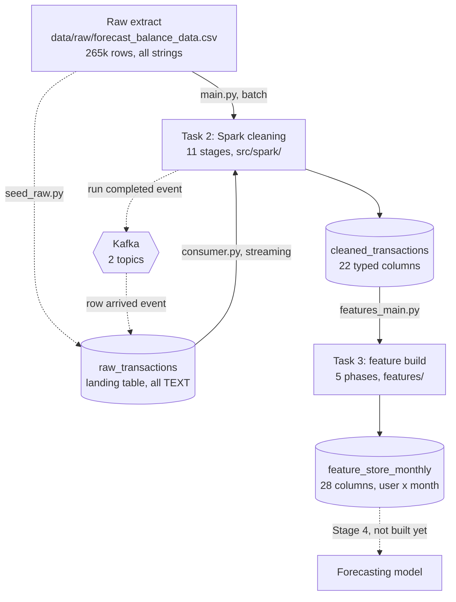
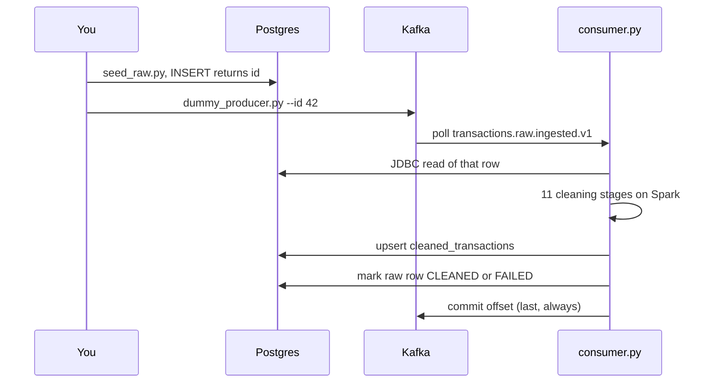
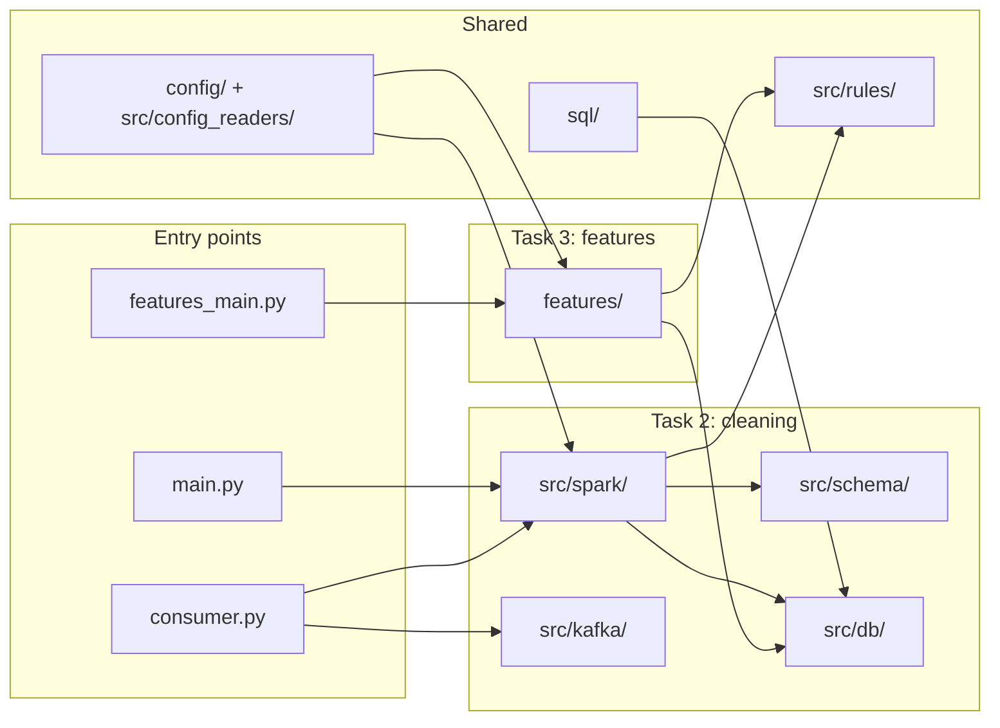
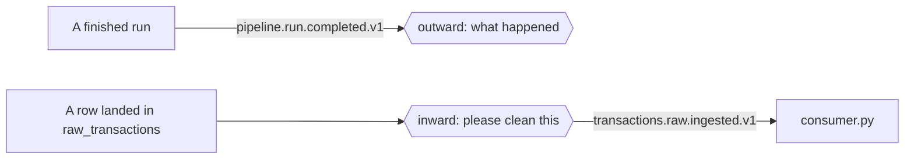
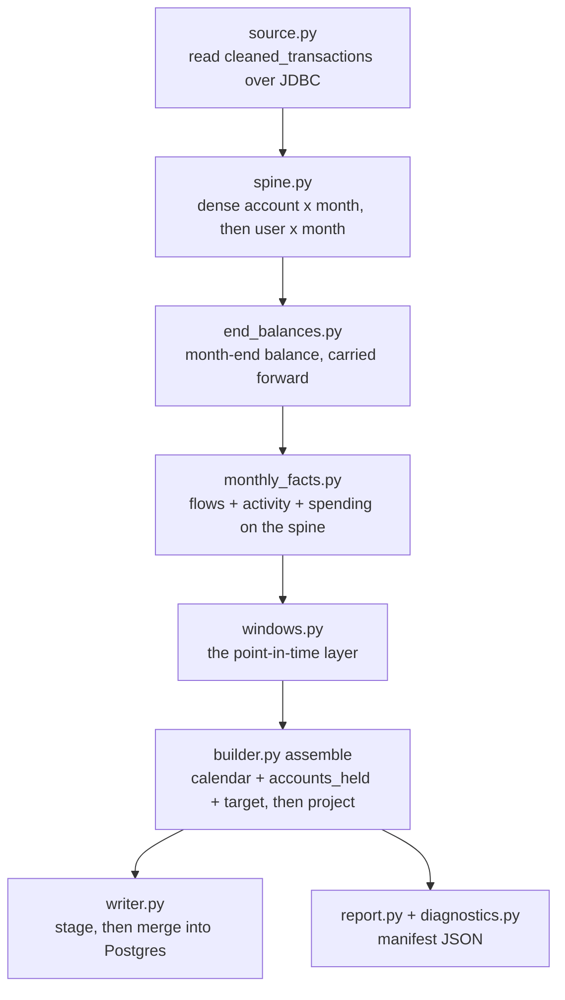
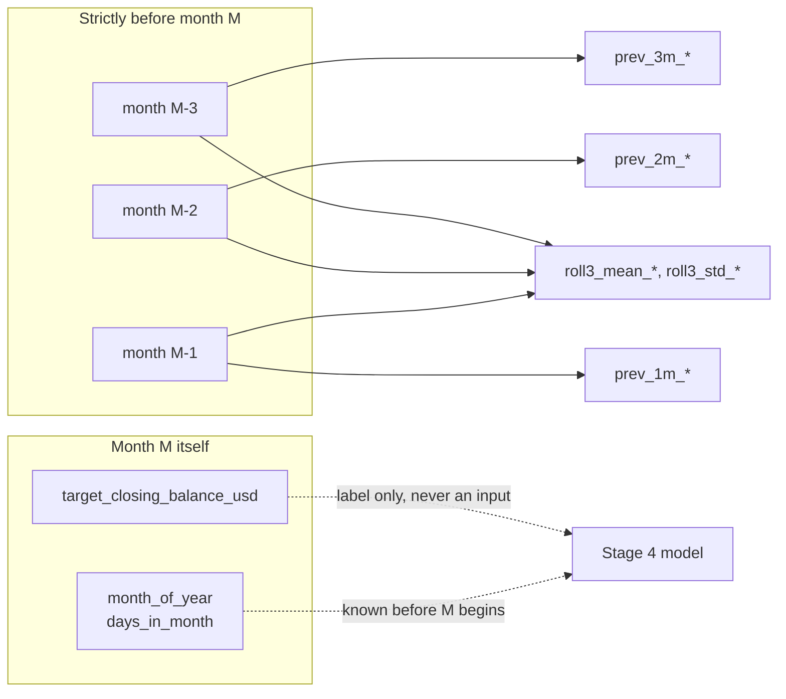

# README V2: Walkthrough Guide

A tour of the repository - Presentation 04/09/2026

1. What does the system do?
2. How do I run each phase?
3. What is in each folder, what does each file do, and which technique does it use?

For the reasoning behind any single decision, see `ARCHITECTURE.md` (Task 2) and
the module docstrings (Task 3). This file is the map, those are the territory.

---

## 1. The system in one picture

Two tasks, one codebase.

- **Task 2** turns a dirty transaction extract into a clean, typed, audited table in Postgres. Batch or streaming, same eleven cleaning stages either way.
- **Task 3** turns that clean table into a monthly feature table for forecasting, one row per user per month, with strict point-in-time correctness.



Three invariants that hold across the whole codebase:

- **Spark end to end.** No stage collects rows into Python. The one exception is the MCC decision, which works on a few thousand merchants rather than a quarter million rows, and its answer is broadcast back.
- **Idempotent writes.** Every write is an upsert keyed on a derived id, so re-running the same input changes nothing a reader can observe.
- **Config as data.** Vocabularies live in JSON, tunable judgements live in YAML, credentials live in the environment. None of them are hardcoded in logic.

---

## 2. How to run each phase

### Phase 0: setup

```bash
python -m venv .venv
.venv\Scripts\Activate.ps1
python -m pip install -r requirements.txt
docker compose up -d
make verify
```

`make verify` checks Java, Spark, Postgres and Kafka, and names the fix for
anything that is down. Run it before anything else.

### Phase 1: batch cleaning (Task 2)

```bash
make run
```

Reads the CSV, cleans it through 11 Spark stages, upserts to
`cleaned_transactions`, publishes a completion event to Kafka.

| Variant | Command |
|---|---|
| Clean and report, write nothing | `python main.py --dry-run` |
| Write but stay silent on Kafka | `python main.py --no-emit` |
| A different source file | `python main.py path/to/file.csv` |
| Force a profile | `python main.py --profile forecast_balance` |
| Prove a replay changed nothing | `make fingerprint` |

### Phase 2: streaming a single transaction (Task 2)



Two terminals. First:

```bash
python consumer.py --batch-size 1
```

Second:

```bash
python -m scripts.seed_raw --count 1
python -m scripts.dummy_producer --id 42
```

The commit is the last step, which is the whole delivery guarantee: a crash
redelivers a row rather than skipping one, and a redelivered row is a no-op
because the write is an upsert.

### Phase 3: the feature build (Task 3)

```bash
make db-rules
```

Seeds the rule tables from `src/rules/json/`. Needed once, and again whenever a
rule file changes.

```bash
make features
```

Reads `cleaned_transactions` plus the rule tables, builds on Spark, upserts to
`feature_store_monthly`, writes the run report to
`data/features/feature_store_monthly.manifest.json`.

`make features-reset` drops the table first, which is required after any change
to `features/contract.py`, because `CREATE TABLE IF NOT EXISTS` will not alter a
table it finds.

### Phase 4: the scaling run (Task 3, deliverable 4)

```bash
make features-scale
```

Runs the same build at 1x, 2x, 3x and 5x, in one Spark session, and writes
`data/features/scaling_report.json` plus `scaling.png`.

### Tests

```bash
make test
```

416 tests. `make test-fast` skips the 42 that start a JVM, and runs in seconds rather than half an hour.

---

## 3. Repository map



| Folder | Owns | Task |
|---|---|---|
| `src/spark/` | The 11 cleaning stages and the orchestrator | 2 |
| `src/schema/` | Column names, status vocabularies, pure helpers | 2 |
| `src/db/` | Postgres schema, contract, staged upsert | 2 and 3 |
| `src/kafka/` | Two topics, producer, consumer, dead letters | 2 |
| `src/rules/` | Domain vocabularies, as JSON and as tables | 2 and 3 |
| `src/config_readers/` | YAML settings, and the config fingerprint | 2 and 3 |
| `features/` | The monthly feature build | 3 |
| `scripts/` | Operational and benchmark entry points | 2 and 3 |
| `eda/` | Read-only profiling, before any cleaning decision | 1 |
| `tests/` | 416 tests, plus the parity harness | all |

---

## 4. Entry points at the root

| File | Goal | Notes |
|---|---|---|
| `main.py` | Batch entry point: read, clean, upsert, emit | Argparse only. The chain itself lives in `src/runner.py` |
| `consumer.py` | Streaming entry point | Owns the CLI, the signal handler and the Spark session. Logic is in `src/kafka/consumer.py` |
| `features_main.py` | Task 3 entry point | Also carries `--seed-rules` |
| `src/runner.py` | The Task 2 chain wired end to end | Caches the cleaned frame once, so report plus write is a single pass instead of three |
| `src/jobs.py` | The identity of one load | `sync_job_id` is a **UUIDv5 over the file contents**, so a replay mints the same id |

`src/jobs.py` is worth naming out loud. A random uuid would make a re-run look
like a second delivery in the audit trail. Deriving the id from the bytes is
what makes idempotency observable rather than merely claimed.

---

## 5. `src/spark/` and the 11 cleaning stages (Task 2)


Order is not cosmetic. `timestamps` runs first because every later group, join
and window keys on the month it produces. `balance` runs after `amounts`
because it moves the running balance by a column that `amounts` has to parse
and sign first.

### The infrastructure files

| File | Goal | Technique |
|---|---|---|
| `spark_setup.py` (514) | Session config, and the CSV read | Every setting stated rather than inherited: `CORRECTED` time parser, ANSI off, session timezone pinned. An inherited default is a bet it will not change between Spark versions |
| `spark_utils.py` (324) | Shared column expressions and broadcast helpers | Stateless expression builders (`text`, `lookup`, `zfill`, `chain`, `one_of`). Holds zero domain knowledge by rule |
| `pipeline.py` (240) | The orchestrator, and the ledger of what is ported | Step registry keyed by the profile name in YAML. A stage becomes tested by being registered here and by nothing else |
| `audit.py` (307) | Turns diagnostic columns into the run report | Two request kinds, `Scalar` and `Tally`. Every scalar in the run is evaluated in one `agg`, every tally in one grouped pass, so **the whole report costs 2 Spark actions** regardless of how many stages ran |
| `stagelog.py` (440) | Narrates a run stage by stage while it happens | ASCII box drawing, deliberately: a `U+2502` reaching a cp1252 Windows console raises `UnicodeEncodeError` from inside the print |

### The stages, and the technique each one uses

| Stage | What it does | Technique |
|---|---|---|
| `timestamps.py` (721) | Normalizes wall clock, resolves the `/` date ambiguity | Python strptime formats **translated to Java patterns** at load, so the format vocabulary stays in one JSON file. The two ambiguity passes become a **broadcast join** (the macro oracle) plus a **window** (`last`/`first` with `ignoreNulls` over `partitionBy(account).orderBy(txn_seq)`). Strict parsing, so an unreadable value becomes null |
| `macro.py` (155) | Recovers interest rate, inflation and FX index | Three **broadcast joins** on month, or month plus country, against 42, 252 and 504 row tables. A stated value always wins over a recovered one, so the expression is `when(stated, ...).otherwise(recovered)` and never `coalesce`, which would quietly repair a corrupt stated value |
| `duplicates.py` (151) | Drops byte-identical rows, suffixes TXN_ID collisions | One `groupBy` over **every column**: the same shuffle both removes the duplicates and counts them. Collisions get a **row_number window** and are never dropped, since two different rows sharing an id may be two real transactions |
| `codes.py` (145) | Pads and labels the processing code and the MCC | `zfill` plus a **map lookup**. An unclassified code produces NULL rather than blank, which is the distinction the whole pipeline is built to preserve |
| `amounts.py` (316) | Parses text amounts, restores signs | **Regex expressions, no UDF.** A Python UDF would serialise every cell across the JVM boundary and make the cheapest stage the most expensive. Five decisions survive as `regexp_replace` chains: strip junk characters, parentheses mean negative, the last separator wins, a single separator is disambiguated by the currency, and anything still unreadable becomes null. The sign comes from the code's declared direction |
| `balance.py` (538) | Reconstructs a running balance per account, and grades it | The heaviest **window** stage. Cumulative sum over `partitionBy(account).orderBy(txn_seq)`, stated balances converted to offsets, previous and next anchors found with `last`/`first` over unbounded frames, forward and backward reconstruction, then a confidence status per row: OBSERVED, DERIVED, FORWARD_DERIVED, BACKWARD_DERIVED, UNVERIFIED, CONTRADICTED, UNAVAILABLE |
| `missing.py` (151) | Sentinel handling for absent and unreadable values | **Regex** (`rlike`, `^0+$`) for three columns. The fourth, whether an auth code recurs across the file, is a **count window partitioned by the value itself**, which replaces a pandas `Counter` that could not survive being distributed |
| `merchant.py` (431) | Cleans merchant names and resolves identity | Two halves treated differently. String reduction is **regex and higher order functions over token arrays**, so no Python runs per row. Identity resolution is three joins: an exact key by **broadcast join** against a 2,100 row master, then two fuzzy prefix rules whose eligible prefixes are precomputed from the master alone and broadcast too |
| `geo.py` (143) | City spelling, country resolution, card-not-present flag | Four **map lookups** against three small tables. The subtlety is which one may be blank: the expected country is blank where a city implies nothing, so consistency does not flag every e-commerce row, while the published country is never blank |
| `mcc.py` (348) | Settles the MCC per merchant, queues conflicts for review | The only stage whose unit is the merchant rather than the row. One `groupBy(merchant, code).count()` distributes the counting, a few thousand rows of Python decide on the driver using a **binomial tail summed in log space**, and the answer is **broadcast** back and joined on. Ties are broken deterministically, since Spark has no file order after a shuffle |
| `consistency.py` (235) | Flags cross-field disagreements, repairs nothing | Pure **boolean column expressions**, with every mask `coalesce`d to False, because a comparison against null is null in Spark and one null would blank the whole flag string for that row |

---

## 6. `src/schema/` (Task 2)

Engine-neutral vocabulary: column names, status values, and pure functions. The
Spark cleaners import from here.

- One module per cleaning concern: `amounts`, `balance`, `codes`, `geo`, `macro`, `mcc`, `merchant`, `missing`, `timestamps`.
- Generated from the reviewed pandas modules by deleting their DataFrame methods. Every surviving line is unchanged from what was reviewed.
- Why it exists: the pipeline was built twice, once in pandas as the reference and once on Spark, and held to the same answers by a parity harness. Parity passed on all eleven stages, the pandas half was deleted, and this is the vocabulary that survived, so a constant or a regex is never spelled twice.

---

## 7. `src/db/` (Tasks 2 and 3)

| File | Goal | Technique |
|---|---|---|
| `settings.py` (183) | Where the database is | Read from the real environment first, then `.env`, matching docker compose precedence so the containers and the clients cannot disagree |
| `contract.py` (199) | Which frame column becomes which table column, and as what type | A pure list of names and casts, so "does the pipeline still produce what the table requires" is answerable in milliseconds with no JVM and no Postgres. 5 of the 22 columns need an explicit cast |
| `writer.py` (89) | The idempotent write | **Project, stage, merge.** Spark bulk-loads into an unlogged mirror table over JDBC, then one `INSERT ... ON CONFLICT` merges it across. Necessary because Spark's JDBC writer has four modes and none of them is an upsert |
| `migrate.py` (152) | Applies `sql/schema.sql` | Every statement is `IF NOT EXISTS`, so the writer can call it before every run. It is not a migration framework, which is why `recreate()` exists separately |
| `raw.py` (339) | The landing table, from Python | Two directions, two drivers: psycopg2 for inserting a handful of rows, JDBC for reading a batch straight into a Spark frame |

---

## 8. `src/kafka/` (Task 2)

Two topics, two directions.



| File | Goal | Technique |
|---|---|---|
| `settings.py` (193) | Broker address and delivery guarantees | Address from the environment, topic names and guarantees from YAML. Config refuses to let the two topic names collapse into one |
| `events.py` (135) | What a completion event says | The payload is a `RunResult` as JSON, carrying the job id, the config fingerprint and every per-stage total. Building and publishing are separate functions, since only one of them needs a broker to test |
| `ingest_events.py` (165) | What "a row arrived" says | A JSON object naming a row id, rather than a bare integer, so the message can be versioned and refused by name |
| `producer.py` (202) | Publishing, and topic creation | `produce()` only queues. Every publish here **flushes and checks the undelivered count**, and raises on failure. Auto-create is off, so a producer aimed at a typo'd topic fails loudly |
| `consumer.py` (640) | The cleaning consumer | Polls, decodes, gathers up to `batch_size` ids into one Spark job, cleans, upserts, marks the raw rows, **then commits**. Recycles the Spark driver every `renew_every` batches, so a driver that never exits does not degrade into one that cannot clean a row |
| `audit_trail.py` (127) | Where an undecodable message goes | Appended to `data/audit_trail/undecodable.jsonl` with its bytes and its offset. A message with no id has no raw row to mark, so this file is the only record it ever arrived |

Failure handling, worth having ready for questions:

| Situation | Behaviour |
|---|---|
| One row will not clean | Marked FAILED with the reason, commit, carry on |
| A whole batch fails | Retried one row at a time, so the failure lands on the guilty row |
| The consumer was down | Nothing is lost, the messages wait on the topic |
| The same row arrives twice | Cleaned again, same values, same job id, no observable change |
| A row was missed entirely | `dummy_producer.py --pending` re-announces everything still PENDING |

---

## 9. `src/rules/` and `config/` (Tasks 2 and 3)

Three different kinds of setting, three different homes. Domain vocabulary is
data, tunable judgement is YAML, credentials are environment variables.

| Location | Contents |
|---|---|
| `src/rules/json/` | 14 JSON files: merchants, city aliases, city countries, currencies, date formats, timestamp formats, FX rates, macro series, MCC rules, processing codes, processors, spending categories, internal descriptors, trap pairs |
| `src/rules/loader.py` (269) | Loads and caches those files, with `CREDIT` and `DEBIT` spelled once |
| `src/rules/store.py` (211) | The Postgres-backed copies Task 3 reads, seeded from the same JSON so the reviewed source stays in git |
| `config/policy.yaml` | Tunable judgements: tolerances, thresholds, widths. Each value sits beside the argument for it |
| `config/pipeline.yaml` | Runtime wiring: paths, profiles, which steps run, Kafka and database wiring |
| `config/features.yaml` | Task 3 settings: eligible balance statuses, rolling window, min periods, destination table, scale factor |

`src/config_readers/` reads all of it:

- `runtime.py` (536): paths, profiles and step lists. **Profile detection** matches a file by the columns it carries, so the v4 workbook and the forecast extract can never be parsed with each other's date rules. A file matching no profile is an error naming what was looked for.
- `policy.py` (341): the tunables, loaded once and frozen. Tuple-backed rather than list-backed, because one policy object is broadcast to every executor.
- `fingerprint.py` (93): a stable hash over policy plus vocabulary, travelling into the rows, the event and the audit trail. It is what makes "identical input, identical state" checkable. It deliberately excludes `pipeline.yaml`, since pointing at a different output directory is still the same run.
- `errors.py`: one `ConfigError`, raised at startup and never mid-run.

---

## 10. `features/` (Task 3)

One row per `(user_id, month)`. 28 columns: 2 keys, 25 features, 1 target.
Every feature on month M is derived from months strictly before M.



### The five build phases, as timed in `builder.py`

| Phase | Module | What happens |
|---|---|---|
| `spine` | `spine.py` | The dense timeline is built |
| `balances` | `end_balances.py` | Month-end balances placed, then carried forward |
| `monthly_facts` | `monthly_facts.py` | Everything that happened during month M |
| `windows` | `windows.py` | Month M is shifted into the past |
| `assemble` | `builder.py` | Calendar, accounts held, target, projection, contract check |

Each phase ends at a **barrier**, meaning the frame is cached and counted. A
Spark frame is a plan rather than a result, so timing the call that builds one
would measure how long it took to describe the work. The barrier costs a count
and buys a measurement of which phase actually dominated.

### File by file

| File | Goal | Technique |
|---|---|---|
| `contract.py` (470) | The column list, declared once | Each column declares **when it becomes knowable**. One list generates the Spark schema, the Postgres DDL and the upsert statement, so the three cannot drift, and the point-in-time rule is enforced from it |
| `source.py` (167) | Reads the cleaned transactions | JDBC read. Selects `billing_amount` and the normalized USD balance only, so the units decision is enforced by never selecting the native-currency columns |
| `spine.py` (173) | A row for every account and every calendar month | `F.sequence` generates the months between an account's first month and the window end, `F.explode` turns that array into rows. This is what makes `prev_1m` mean the previous **calendar** month rather than the previous month that happened to have a transaction. It also raises if an account appears under two users, which would double-count a balance |
| `end_balances.py` (152) | Month-end balance per account, carried forward, rolled up to the user | **Window functions**: the last balance within a month, then `last(..., ignoreNulls)` over an unbounded preceding frame to carry a quiet month forward. Nothing is ever filled backwards |
| `flows.py` (123) | Money in and money out, in USD | `groupBy` sum, with the direction taken from a **broadcast map** of processing code to CREDIT or DEBIT, never from the sign the source wrote on the amount. A code declaring no direction enters neither total and is counted in the report |
| `spending.py` (136) | Monthly spend split across categories | `groupBy` over the MCC-to-category map from the rule tables. Amounts only, no shares, since a share is a division Stage 4 can do from two columns already on the row |
| `activity.py` (151) | Transaction count, distinct merchants, accounts held | `countDistinct` for merchants, and a **running window** for `accounts_held`, which is point in time, so an account opened in month 40 is invisible to month 3 |
| `monthly_facts.py` (144) | Assembles the above on the dense spine | Zero-fill for a quiet month's flows, no fill for its balance. A quiet month really did credit nothing, and really does still hold a balance |
| `windows.py` (225) | The point-in-time layer, and the only place a lag is taken | `F.lag` for `prev_1m/2m/3m`, and `rowsBetween(-3, -1)` for the rolling mean and standard deviation. The frame **says in the expression itself** that month M is excluded, which is why the rule lives in exactly one file |
| `diagnostics.py` (299) | Counts what the build did to itself | Same collection pattern as `src/spark/audit.py`: every scalar per grain in a single `agg`, each breakdown one grouped pass. Includes `approx_percentile` for the dormancy distribution |
| `report.py` (501) | The run manifest and data-quality report | Every metric is an object with `value`, `what` it counts and what it `means`, plus the denominator it is a fraction of. A number in one file and its documentation in another is a pair that drifts |
| `writer.py` (235) | The upsert | Same stage-then-merge as Task 2. Repeated rather than shared, because the keys and columns differ and the part worth sharing is the reasoning, which is written in both places |
| `scale.py` (114) | Replication for the benchmark | `explode` for N copies, then a **derived UUID per copy**: MD5 over `"<id>#<copy>"` with the version and variant nibbles fixed, so the result is a valid RFC-4122 v3 UUID and fits the Postgres `UUID` column. Built in Spark SQL rather than a UDF, since a UDF is the opposite of what a timing run needs |
| `settings.py` (173) | Reads `config/features.yaml` | Validated once into a frozen dataclass, so a typo fails in the first second |

### The point-in-time rule, in one diagram



The calendar columns are the only unlagged features, because 1 to 12 and 28 to
31 are properties of the Gregorian calendar and are fixed before the month
begins. Diagnostics such as the carry-forward count are lagged along with
everything else, so they cannot become a back door into month M, then dropped
at the final projection.

---

## 11. `scripts/`, `eda/`, `tests/` and `sql/`

### `scripts/`

| File | Goal |
|---|---|
| `verify_env.py` (504) | Does this machine run the stack? Checks are ordered cheapest first, and every failure names its own fix |
| `seed_raw.py` (177) | Inserts real rows cut from the extract into `raw_transactions` and prints their ids |
| `dummy_producer.py` (216) | Publishes "a row arrived", by id, by id list, or `--pending` for recovery |
| `fingerprint.py` (83) | One line describing the whole cleaned table, for proving a replay changed nothing |
| `scaling_report.py` (472) | The 1x/2x/3x/5x benchmark, all in one Spark session |
| `scaling_chart.py` (144) | The curve on log-log axes, where `cost ~ rows ** k` is a straight line of gradient k |

### `eda/`

`profiler.py` (331), read-only, pandas. Duplicates, nulls, and placeholder
strings that look like data (`"NA"`, `"N/A"`, `"-"`). Run before any cleaning
decision, never during a run.

### `tests/` (416 tests)

| Group | Covers |
|---|---|
| `test_config`, `test_profiles` | YAML validation, profile detection |
| `test_spark_*` | Session settings, source reading, the audit collection |
| `test_db_*` | Contract, raw table, settings, the staged write |
| `test_kafka_*` | Events, producer, consumer, ingest events, dummy producer |
| `test_features_*` | Aggregation, point in time, units, rules, artifacts |
| `test_scaling_report`, `test_streaming`, `test_stagelog` | Benchmark shape, end to end flow, narration |
| `harness/` | The parity harness: it samples **accounts** rather than rows, because a balance depends on the previous row within the same account |

### `sql/`

`schema.sql` (170) is `cleaned_transactions` plus its staging mirror,
`raw_schema.sql` (100) is the landing table, and `features_schema.sql` (57) is
the rule tables Task 3 reads.

---

## 12. Results worth quoting

### Task 2, on the source file

| Check | Result |
|---|---|
| Dates unparsed | 0 of 4,592 values |
| Amounts unparsed | 0, with 15 reformatted and 13 signs restored |
| Cities | 128 distinct collapsed to 107 |
| Merchants | 586 spellings resolved to 270 merchants, 0 unrecognised |
| MCC | 137 curated, 11 queued for review |
| Rows flagged for review | 643 |

Every number comes from `cleaning_report`, computed by the audit pass rather
than counted by hand.

### Task 3, the scaling run

| Factor | Rows | Users | Feature rows | Total seconds |
|---|---|---|---|---|
| 1x | 253,779 | 151 | 6,463 | 34.3 |
| 2x | 507,558 | 302 | 12,926 | 38.2 |
| 3x | 761,337 | 453 | 19,389 | 53.3 |
| 5x | 1,268,895 | 755 | 32,315 | 76.6 |

- 5x the users costs **2.24x** the time.
- Fitted exponent 0.51 over the full range, 0.71 over the tail. Every phase reads linear, and none is flagged `bending_up`.
- The slope **understates**, because fixed overhead biases it downward, which is what keeps it usable: a slope near 2 would be conclusive and could not be explained away by overhead.
- Scaling is in **users**, since `scale.py` re-keys each copy. Months per user is held constant, so the exponent says nothing about a longer calendar.
- Two known ceilings, both configuration rather than algorithm: the JDBC read in `features/source.py` has no `partitionColumn`, so the source arrives through one connection on one partition, and `spark.sql.shuffle.partitions` is pinned to 8 against `local[8]`.

---

## 13. Suggested 30 minute walkthrough

| Minutes | Show | Point to make |
|---|---|---|
| 0 to 3 | The diagram in section 1 | Two tasks, one codebase, three invariants |
| 3 to 8 | `make run`, then `make fingerprint` twice | Idempotency is observable, not claimed |
| 8 to 14 | `src/spark/pipeline.py`, then `amounts.py` and `balance.py` | The registry is the ledger. Regex expressions replace a UDF, windows replace row loops |
| 14 to 18 | Two terminals, `consumer.py` and `dummy_producer.py` | Commit ordering is the delivery guarantee |
| 18 to 24 | `features/windows.py`, then `features/contract.py` | The point-in-time rule lives in one file and is enforced from one column list |
| 24 to 28 | `data/features/scaling.png` and the table in section 12 | Linear in users, with the two ceilings named openly |
| 28 to 30 | The Future work section of `README.md` | What is known to be blunt, and what comes next |
